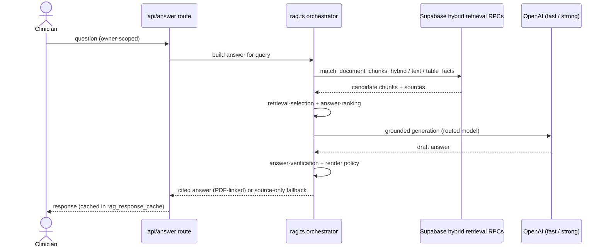

# PsychSift — Codebase Index

Structured map for AI agents and onboarding. For live routes, see `docs/site-map.md` (`npm run docs:update` / `sitemap:check`). For agent rules and verification gates, see `AGENTS.md`; for test execution and flake policy, see `docs/testing.md`.

_Updated 2026-09-26 — added the generated Areas section from the organisation map._

**Stack:** Next.js 16, React 19, Supabase (pgvector, Storage, Auth), OpenAI, Python OCR worker.  
**Live Supabase:** `PsychSift Production` — ref `sjrfecxgysukkwxsowpy` (never use stale `qjgitjyhxrwxsrydablr`).

---

## Quick start

| Step                              | Command                                                                          |
| --------------------------------- | -------------------------------------------------------------------------------- |
| Confirm Supabase target           | `npm run check:supabase-project` (provider-backed — needs explicit confirmation) |
| Start app (project-specific port) | `npm run ensure`                                                                 |
| Start ingestion worker            | `npm run worker`                                                                 |
| Cheap verification gate           | `npm run verify:cheap`                                                           |
| UI verification gate              | `npm run verify:ui`                                                              |

---

## Orientation summary

The two blocks below were carried in `CLAUDE.md` until the instruction files were tiered.
They are reproduced verbatim; the detailed maps that follow supersede nothing here.

### Repository layout

```
src/app/          Next.js App Router — (search-app) route group, api/, auth/, mockups/
src/components/   UI; clinical-dashboard/ is the shell, *-mockups.tsx are design scratch
src/lib/          ~200 modules — rag/, supabase/, validation/, observability/,
                  extractors/, webhooks/ are the extracted subdirectories
src/data/         Static clinical content (DSM, formulation, therapies indexes)
data/             Generated clinical snapshot exports loaded at runtime — regenerate, never hand-edit
supabase/         migrations/ (source of truth), schema.sql (mirror), functions/
worker/           Ingestion worker; worker/python/ is the OCR stack
scripts/          gates, eval, reindex, governance, dev — counted and mapped in docs/scripts-index.md
tests/            Vitest unit + Playwright E2E, side by side
docs/             Runbooks, governance, plans; docs/README.md categorises them
eslint-rules/     Repo-specific lint rules (see Conventions below)
mockups/          Notes for the design-scratch routes under src/app/mockups/
plugins/          plugins/clinical-kb/ Codex plugin manifest and workflow skill
.claude/          Claude Code agents, skills, hooks, settings
.agents/          Single-word skill catalogue (`npm run skills`)
.cursor/          Cursor project rules and local-agent configuration
.design-sync/     Generated design-system package metadata and validation notes
.githooks/        Installed by `npm install`; pre-push runs scripts/guard-push.mjs
.docker/           Buildx configuration for reproducible container builds
.vscode/          Shared VS Code workspace recommendations and settings
```

Never commit: `.next/`, `node_modules/`, `coverage/`, `.env*`, `sample-documents/`, logs.

The product surface is **20 app modes** (`src/lib/app-modes.ts`, counted 2026-09-26) sharing one search shell:
answer, documents, services, forms, favourites, differentials, dsm, specifiers, formulation,
prescribing, tools, calculators, therapy-compass, factsheets, dictionary, sources, on-call, cme.

### The two flows that matter

**Answer (read path).** `/api/answer/stream` (the route the UI calls; `/api/answer` is the
non-streaming twin) → `src/lib/rag/rag.ts` orchestrates: hybrid retrieval
via Postgres RPCs (called from `src/lib/rag/rag-candidate-sources.ts`) (pgvector HNSW + tsvector/trigram) → `retrieval-selection` →
`answer-ranking` → routed OpenAI generation (fast vs strong) → `answer-verification` and
render policy → cited answer. If generation fails the quality gates it degrades to a
deterministic **source-only** answer that still cites real documents — that is expected
behaviour, not a bug. Responses cache in `rag_response_cache`.

**Ingestion (write path).** `/api/upload` → private `clinical-documents` bucket, then one RPC
(`create_uploaded_document_with_ingestion_job`) creates the `documents` and `ingestion_jobs`
rows → `worker/main.ts` claims the job (`claim_ingestion_jobs`; the `indexing-v3-agent` Edge
Function works a separate strict-enrichment queue) → extract (PDF/DOCX/XLSX/TXT) → OCR fallback → image captioning → chunking → OpenAI
embeddings → chunks, pages, images, embedding fields, index units, table facts → quality
gates in `document_index_quality`. Reindex commits atomically per generation
(`reindex-pipeline.ts`). Lifecycle detail: `docs/ingestion-state-machine.md`.

Both paths are owner-scoped: `owner-scope.ts`, `query-privacy.ts`, `authorization.ts`.

<!-- organisation-areas:start -->
<!-- Generated from the area files in docs/organisation/systems/ by node scripts/organisation/codebase-index-section.mjs --write (the pre-commit docs sync runs it). Edit those files, not this section. -->

## Areas (organisation map)

Every tracked file belongs to one area of the organisation map, and an area describes a job, never a page or a mode. The guide is `docs/organisation/README.md`; `npm run check:organisation -- --files <path>` names the area that owns a file. This section lists only each area's job and canonical docs, so moving files never makes it stale.

- **Answer engine** (`answer-engine`): Turning a question into a cited answer: retrieval, ranking, answer building, citation checks, the clinical-ask pipeline and the eval harness.
  Canonical docs: docs/rag-behaviour/README.md, docs/rag-behaviour/safeguards.md
- **App experience** (`app-experience`): Every page, the shared shell, navigation, search chrome, client-side search and filtering, demo mode and offline behaviour.
  Canonical docs: docs/frontend-architecture.md, docs/search-chrome-behaviour.md
- **Clinical reference content** (`clinical-content`): Facts a clinician reads, and where each came from: the records themselves, their sources, sign-off and publication.
  Canonical docs: docs/clinical-governance.md, docs/source-acquisition-protocol.md
- **Data platform and access** (`data-platform`): Database schema, migrations and drift guards, auth, owner scope, privacy, environment, proxy, security headers and observability.
  Canonical docs: docs/database-drift-detection.md, docs/supabase-migration-reconciliation.md
- **Delivery and assurance** (`delivery`): Getting a change safely from branch to live: CI, git hooks, gates, budgets, containers, deploy config and test tooling.
  Canonical docs: docs/agents/verification-gates.md, docs/testing.md, docs/deployment-architecture.md
- **Knowledge and records** (`knowledge`): How people and agents know how to work, and what has been decided, found or left open: entry docs, agent tooling, ledgers and records.
  Canonical docs: docs/agents-guide.md, docs/README.md, docs/DOCS-SYSTEM.md
- **Personal practice** (`personal-practice`): The clinician's own records and tools: their logic, data and server routes. Pages sit in App experience.
  Canonical docs: docs/personal-practice/README.md, docs/codebase-index.md
- **Source intake and indexing** (`source-intake`): Any source becoming searchable: upload, extraction, OCR, captions, chunking, embeddings, index units and the ingestion worker.
  Canonical docs: docs/ingestion-state-machine.md, docs/reindex-runbook.md, docs/worker-deploy-runbook.md

Workstreams cut across the areas:

- **Design system** (`design-system`): Visual tokens, primitives, brand and the lint rules that enforce them; serves every screen.
  Canonical docs: docs/design-system/README.md
- **Prototypes** (`prototypes`): Admin-only work that is not yet part of the product: Care Plan, the developer hub and design-scratch mock-ups.
  Canonical docs: docs/care-plan/CLAUDE-START-HERE.md

<!-- organisation-areas:end -->

## Top-level layout

| Path        | Purpose                                                                                                                                                |
| ----------- | ------------------------------------------------------------------------------------------------------------------------------------------------------ |
| `src/`      | Next.js App Router UI, API routes, shared lib, components                                                                                              |
| `supabase/` | SQL migrations, schema mirror, Edge Functions, CLI config                                                                                              |
| `worker/`   | Local ingestion worker (parse, OCR, chunk, embed, DB writes)                                                                                           |
| `scripts/`  | CLI ops: reindex, eval, backfill, governance, dev-server helpers                                                                                       |
| `tests/`    | Vitest unit (`*.test.ts`) + Playwright E2E (`ui-*.spec.ts`)                                                                                            |
| `docs/`     | Runbooks, governance, search/RAG plans, generated sitemap; design-system system of record is [`docs/design-system/README.md`](design-system/README.md) |
| `public/`   | Static assets (`public/llms.txt`)                                                                                                                      |
| `.github/`  | CI workflows, PR template (clinical governance preflight)                                                                                              |

Smaller top-level directories that are easy to miss:

| Path            | Purpose                                                                                                                                                                                                                                                                                                             |
| --------------- | ------------------------------------------------------------------------------------------------------------------------------------------------------------------------------------------------------------------------------------------------------------------------------------------------------------------- |
| `data/`         | Committed clinical **snapshot exports** loaded at runtime by `src/lib/` (differentials, forms, medications, services, specifiers). Regenerate via the matching `scripts/import-*-export.ts` / `build-*-index.mjs`; do not hand-edit. Distinct from `src/data/`, which holds hand-authored static content.           |
| `eval/`         | Isolated evaluation labs, outside the product/runtime dependency graph. `eval/docling/` is the sandboxed, dispatch-only Docling extraction benchmark (own hashed Python lock + venvs, egress-blocked Docker run, synthetic fixtures + hostile corpus, aggregate-only reports; `docs/rag-improvement/README.md` §B3) |
| `eslint-rules/` | Repo-specific lint rules enforced by `npm run lint` (button wiring, hardcoded hex, type/icon scale, z-index ladder)                                                                                                                                                                                                 |
| `mockups/`      | Notes for the design-scratch routes under `src/app/mockups/` (the routes themselves 404 in production)                                                                                                                                                                                                              |
| `plugins/`      | `plugins/clinical-kb/` Codex plugin manifest and workflow skill                                                                                                                                                                                                                                                     |
| `.agents/`      | Canonical single-word skill catalogue (`npm run skills`); `npm run check:skills` also validates Claude, Cursor, and plugin skill policies                                                                                                                                                                           |
| `.claude/`      | Claude Code agents, skills, hooks, settings — plus the `.claude/worktrees/` working copies                                                                                                                                                                                                                          |
| `.codex/`       | Trusted Desktop/CLI config; tracked `config.toml` has disabled, secret-free Figma, Supabase, Railway, and Sentry MCP templates. Hosted ChatGPT/Codex apps are installed and authenticated separately; OAuth stays in the host credential store.                                                                     |
| `.cursor/`      | Cursor project rules and local-agent configuration                                                                                                                                                                                                                                                                  |
| `.design-sync/` | Generated design-system package metadata, validation notes, and project-sync artifacts                                                                                                                                                                                                                              |
| `.githooks/`    | Installed by `npm install`; `pre-push` runs `scripts/guard-push.mjs` (user-owned auto-merge preservation, format, drift staleness, static lint+typecheck, ledger write discipline)                                                                                                                                  |
| `.docker/`      | Buildx configuration for reproducible container builds                                                                                                                                                                                                                                                              |
| `.vscode/`      | Shared VS Code workspace recommendations and settings                                                                                                                                                                                                                                                               |

Local task coordination lives in `.superpowers/`: ignored task briefs, review packets, and verification logs.

**Do not commit:** `.next/`, `node_modules/`, `coverage/`, `.env*`, `sample-documents/`, logs.

---

## Application architecture

### Shell and routing

- **Root layout:** `src/app/layout.tsx` — fonts, theme cookie (`ckb-v2` + `dark` classes), CSP nonce, `AuthProvider` → `AccountDataProvider` → `MobileKeyboardProvider`, PWA lifecycle, web-vitals reporter, `OverlayRoot`; global CSS is `src/app/globals.css` plus `src/app/ckb-v2-tokens.css`
- **Proxy:** `src/proxy.ts` (Next 16's replacement for middleware) — CSP nonce, API mutation CSRF check, upload size cap, developer-area header/devkey handling, production 404 for `/mockups/**`, Supabase session refresh, and redirects
- **Shared search-app layout:** `src/app/(search-app)/layout.tsx` + `src/components/clinical-dashboard/shared-search-app-shell.tsx` — keeps `GlobalSearchShell` mounted across mode homes
- **App shell:** `src/components/clinical-dashboard/global-search-shell.tsx` — canonical route-aware shell and lazy dashboard dispatch. The mockup-named module is a compatibility re-export used only below `/mockups`.
- **PWA:** `docs/pwa.md` — install assets, privacy-first service worker/offline shell, lifecycle, security, and verification
- **Home:** `src/app/(search-app)/page.tsx` — dashboard rendered by shell; the shared home for every mode as `/?mode=<id>`
- **Consolidated mode homes:** bare mode paths (`/documents`, `/dsm`, `/dictionary`, `/factsheets`, `/services`, `/forms`, `/calculators`, `/specifiers`, `/formulation`, `/differentials`, `/therapy-compass`, `/sources`) 307 to `/?mode=<id>`, and submitted queries (`?q=…&run=1`) to `/<mode>/search` — `src/lib/consolidated-mode-home-redirect.ts`, applied in `src/proxy.ts`, with each page's own `redirect()` as a backstop. `/medications` goes to `/?mode=prescribing`. Only `/tools`, `/favourites`, `/on-call`, `/cme`, `/psychiatry`, `/my-work`, `/roster` and `/first-nations` render their own home.
- **Dashboard:** `src/components/ClinicalDashboard.tsx` + `src/components/clinical-dashboard/`
- **Modes (22, counted 2026-09-27):** `src/lib/app-modes.ts` — answer, documents, services, forms, favourites, differentials, DSM-5 diagnosis, specifiers, formulation, prescribing, tools, calculators, Therapy, Factsheets, Dictionary, Sources, On Call, CPD (mode id `cme`), Psychiatry, My Work (mode id `my-work`), Roster (mode id `roster`), First Nations (mode id `first-nations`)

  - **Sources catalogue:** `/sources/search` (bare `/sources` redirects to the shared home) provides a read-only, quality-banded catalogue with Topics, Publishers, Method and source-detail traceability; `/dictionary/sources` redirects into its Dictionary-filtered view. Method (`/sources/method`) and the Guide Centre's Source rating topic both render `src/components/reference/source-method-reference-content.tsx` — one component, `variant: "page" | "guide"`, the same arrangement `colour-coding-reference-content.tsx` uses for `/reference/colour-coding`.
  - **Therapy review disclosure.** Therapy was `devOnly` while its 205-record catalogue awaited qualified-clinician sign-off. That hid the mode from production navigation, 404'd `/therapy-compass` in the route layout, and made `therapyRecordsForEnvironment` filter every record out — so all 205 detail/brief/sheet routes and every universal-search therapy hit 404'd for real users while working locally. The owner's decision (2026-08-19) replaced the gate with disclosure: reachability is no longer conditioned on review status anywhere, and the caveat is stated per record instead, by the `reviewStatus` badge on every card, detail page, brief, sheet, comparison, pathway, and universal-search result. A catalogue-wide banner (`TherapyReviewNotice`, counts from the generated `THERAPY_CATALOGUE_SUMMARY.needsReviewCount`) sat above the search band until 2026-09-06, when the owner removed it: a caveat repeated above every search is read past, while the per-record badge sits where the decision is actually made. `therapyNeedsReview` survives as the label source only. Pinned by `tests/app-modes.test.ts` (reachability), `tests/therapy-review-regressions.test.ts` (the per-record badges, and the banner's absence), and `tests/therapy-pr-unblocking-contract.test.ts` (the retired `PLAYWRIGHT_OFFLINE_MODE` bypass that existed only to reach the gated route).

### Product pages (`src/app/`)

| Route                                                                                                                                                                                                   | File                                                                                                                            |
| ------------------------------------------------------------------------------------------------------------------------------------------------------------------------------------------------------- | ------------------------------------------------------------------------------------------------------------------------------- |
| `/`                                                                                                                                                                                                     | `src/app/(search-app)/page.tsx`                                                                                                 |
| Shared mode-home route group (`/(search-app)`)                                                                                                                                                          | `src/app/(search-app)/`                                                                                                         |
| Mode homes (`/?mode=<id>`; bare `/services`, `/dsm`, `/documents`, … redirect there)                                                                                                                    | `src/app/(search-app)/page.tsx` + `home-page-client.tsx`                                                                        |
| `/applications` (307 to `/tools`)                                                                                                                                                                       | `src/app/applications/route.ts`                                                                                                 |
| `/differentials/search`, `/differentials/diagnoses`, `/differentials/diagnoses/[slug]`, `/differentials/presentations`, `/differentials/presentations/[slug]`, `/differentials/compare`                 | `src/app/(search-app)/differentials/`                                                                                           |
| `/dsm/search`, `/dsm/compare`, `/dsm/diagnoses/[slug]`, `/dsm/diagnoses/[slug]/differentials`                                                                                                           | `src/app/(search-app)/dsm/`                                                                                                     |
| `/documents/search`, `/documents/[id]` (`/documents/source` and `/documents/source/evidence` redirect to `/documents/[id]`)                                                                             | `src/app/(search-app)/documents/`                                                                                               |
| `/factsheets`, `/factsheets/search`, `/factsheets/topics`, `/factsheets/[slug]`                                                                                                                         | `src/app/(search-app)/factsheets/`                                                                                              |
| `/dictionary/search` (Terms, one catalogue — `/browse` redirects to it), `/dictionary/topics`, `/dictionary/topics/[slug]`, `/dictionary/[slug]`, `/dictionary/compare`                                 | `src/app/(search-app)/dictionary/`                                                                                              |
| `/sources/search`, `/sources/topics`, `/sources/publishers`, `/sources/method`, `/sources/[sourceId]`                                                                                                   | `src/app/(search-app)/sources/`                                                                                                 |
| `/favourites`                                                                                                                                                                                           | `src/app/(search-app)/favourites/page.tsx`                                                                                      |
| `/forms/search`, `/forms/[slug]`                                                                                                                                                                        | `src/app/(search-app)/forms/`                                                                                                   |
| `/medications/[slug]` (bare `/medications` redirects to `/?mode=prescribing`)                                                                                                                           | `src/app/(search-app)/medications/`                                                                                             |
| `/privacy`                                                                                                                                                                                              | `src/app/privacy/page.tsx` → `privacy-quiet-signal-page.tsx` + `privacy-page-content.tsx`                                       |
| `/reference/colour-coding`                                                                                                                                                                              | `src/app/reference/`                                                                                                            |
| `/safety-plan`                                                                                                                                                                                          | `src/app/safety-plan/page.tsx`                                                                                                  |
| `/calculators`, `/calculators/search`                                                                                                                                                                   | `src/app/(search-app)/calculators/`                                                                                             |
| `/services/search`, `/services/[slug]`                                                                                                                                                                  | `src/app/(search-app)/services/`                                                                                                |
| `/therapy-compass/search`, `/recommend`, `/compare`, `/pathways`, `/review`, `/[slug]`, `/[slug]/brief`, `/[slug]/sheet`                                                                                | `src/app/(search-app)/therapy-compass/`                                                                                         |
| `/on-call` (Now), `/whos-on`, `/call`, `/refer`, `/find`, `/on-call/card`, `/compliance`, `/contacts`, `/education`, `/logistics`, `/orientation`, `/playbook`, `/referrals`, `/service`, `/who-is-who` | `src/app/(search-app)/on-call/` (see On Call mode below)                                                                        |
| `/cme` (dashboard), `/cme/log`, `/cme/log/[id]`, `/cme/new`, `/cme/plan`, `/cme/programme`, `/cme/routines`, `/cme/setup`, `/cme/summary`, `/cme/customise`                                             | `src/app/(search-app)/cme/` (see Continuing education below)                                                                    |
| `/tools`                                                                                                                                                                                                | `src/app/(search-app)/tools/`                                                                                                   |
| `/specifiers/search`, `/specifiers/[slug]`, `/specifiers/builder`, `/specifiers/compare`, `/specifiers/map`                                                                                             | `src/app/(search-app)/specifiers/`                                                                                              |
| `/formulation/search`, `/formulation/[slug]`, `/formulation/builder`, `/formulation/compare`, `/formulation/map`                                                                                        | `src/app/(search-app)/formulation/`                                                                                             |
| `/mockups/*`                                                                                                                                                                                            | `src/app/mockups/` (404 in production; `/mockups/development` and `/mockups/care-plan` are developer-gated instead — see below) |
| `/auth/callback`                                                                                                                                                                                        | `src/app/auth/callback/route.ts`                                                                                                |
| `/auth/reset-password`                                                                                                                                                                                  | `src/app/auth/reset-password/page.tsx`                                                                                          |
| PWA and SEO (`/manifest.webmanifest`, `/robots.txt`, `/sitemap.xml`, OG image, icons)                                                                                                                   | `src/app/manifest.ts`, `robots.ts`, `sitemap.ts`, `opengraph-image.tsx`, `apple-icon.tsx`, `icons/[variant]/route.tsx`          |
| Route                                                                                                                                                                                                   | File                                                                                                                            |
| ---------------------------------------------------------------------------------------------------------------------------------------------------------------------------------------                 | ------------------------------------------------------------------------------------------------------------------------------- |
| `/`                                                                                                                                                                                                     | `src/app/(search-app)/page.tsx`                                                                                                 |
| Shared mode-home route group (`/(search-app)`)                                                                                                                                                          | `src/app/(search-app)/`                                                                                                         |
| Chrome-free route group (`/(display)`, no layout of its own): Teaching's shared check-in screen, `/teaching/display/[token]`                                                                            | `src/app/(display)/`                                                                                                            |
| Mode homes (`/?mode=<id>`; bare `/services`, `/dsm`, `/documents`, … redirect there)                                                                                                                    | `src/app/(search-app)/page.tsx` + `home-page-client.tsx`                                                                        |
| `/applications` (307 to `/tools`)                                                                                                                                                                       | `src/app/applications/route.ts`                                                                                                 |
| `/differentials/search`, `/differentials/diagnoses`, `/differentials/diagnoses/[slug]`, `/differentials/presentations`, `/differentials/presentations/[slug]`, `/differentials/compare`                 | `src/app/(search-app)/differentials/`                                                                                           |
| `/dsm/search`, `/dsm/compare`, `/dsm/diagnoses/[slug]`, `/dsm/diagnoses/[slug]/differentials`                                                                                                           | `src/app/(search-app)/dsm/`                                                                                                     |
| `/documents/search`, `/documents/[id]` (`/documents/source` and `/documents/source/evidence` redirect to `/documents/[id]`)                                                                             | `src/app/(search-app)/documents/`                                                                                               |
| `/factsheets`, `/factsheets/search`, `/factsheets/topics`, `/factsheets/[slug]`                                                                                                                         | `src/app/(search-app)/factsheets/`                                                                                              |
| `/dictionary/search` (Terms, one catalogue — `/browse` redirects to it), `/dictionary/topics`, `/dictionary/topics/[slug]`, `/dictionary/[slug]`, `/dictionary/compare`                                 | `src/app/(search-app)/dictionary/`                                                                                              |
| `/sources/search`, `/sources/topics`, `/sources/publishers`, `/sources/method`, `/sources/[sourceId]`                                                                                                   | `src/app/(search-app)/sources/`                                                                                                 |
| `/favourites`                                                                                                                                                                                           | `src/app/(search-app)/favourites/page.tsx`                                                                                      |
| `/forms/search`, `/forms/[slug]`                                                                                                                                                                        | `src/app/(search-app)/forms/`                                                                                                   |
| `/medications/[slug]` (bare `/medications` redirects to `/?mode=prescribing`)                                                                                                                           | `src/app/(search-app)/medications/`                                                                                             |
| `/privacy`                                                                                                                                                                                              | `src/app/privacy/page.tsx` → `privacy-quiet-signal-page.tsx` + `privacy-page-content.tsx`                                       |
| `/reference/colour-coding`                                                                                                                                                                              | `src/app/reference/`                                                                                                            |
| `/safety-plan`                                                                                                                                                                                          | `src/app/safety-plan/page.tsx`                                                                                                  |
| `/calculators`, `/calculators/search`                                                                                                                                                                   | `src/app/(search-app)/calculators/`                                                                                             |
| `/services/search`, `/services/[slug]`                                                                                                                                                                  | `src/app/(search-app)/services/`                                                                                                |
| `/therapy-compass/search`, `/recommend`, `/compare`, `/pathways`, `/review`, `/[slug]`, `/[slug]/brief`, `/[slug]/sheet`                                                                                | `src/app/(search-app)/therapy-compass/`                                                                                         |
| `/on-call` (dashboard), `/on-call/card`, `/compliance`, `/contacts`, `/education`, `/logistics`, `/orientation`, `/playbook`, `/referrals`, `/service`, `/who-is-who`                                   | `src/app/(search-app)/on-call/` (see On Call mode below)                                                                        |
| `/cme` (dashboard), `/cme/log`, `/cme/log/[id]`, `/cme/new`, `/cme/plan`, `/cme/programme`, `/cme/routines`, `/cme/setup`, `/cme/summary`, `/cme/customise`                                             | `src/app/(search-app)/cme/` (see Continuing education below)                                                                    |
| `/tools`                                                                                                                                                                                                | `src/app/(search-app)/tools/`                                                                                                   |
| `/specifiers/search`, `/specifiers/[slug]`, `/specifiers/builder`, `/specifiers/compare`, `/specifiers/map`                                                                                             | `src/app/(search-app)/specifiers/`                                                                                              |
| `/formulation/search`, `/formulation/[slug]`, `/formulation/builder`, `/formulation/compare`, `/formulation/map`                                                                                        | `src/app/(search-app)/formulation/`                                                                                             |
| `/mockups/*`                                                                                                                                                                                            | `src/app/mockups/` (404 in production; `/mockups/development` and `/mockups/care-plan` are developer-gated instead — see below) |
| `/auth/callback`                                                                                                                                                                                        | `src/app/auth/callback/route.ts`                                                                                                |
| `/auth/reset-password`                                                                                                                                                                                  | `src/app/auth/reset-password/page.tsx`                                                                                          |
| PWA and SEO (`/manifest.webmanifest`, `/robots.txt`, `/sitemap.xml`, OG image, icons)                                                                                                                   | `src/app/manifest.ts`, `robots.ts`, `sitemap.ts`, `opengraph-image.tsx`, `apple-icon.tsx`, `icons/[variant]/route.tsx`          |

Legacy On Call bookmarks `/on-call/shifts` and `/on-call/calendar` now redirect to `/roster/shifts` and `/roster/calendar`. Their compatibility pages remain under `src/app/(search-app)/on-call/`.

### API routes (`src/app/api/`)

| Area             | Routes                                                                                                                                                                                                                                                                                                                                                                                                                                                                                                                                                                                                                                                                                                                                                                                                                 | Entry files                                                     |
| ---------------- | ---------------------------------------------------------------------------------------------------------------------------------------------------------------------------------------------------------------------------------------------------------------------------------------------------------------------------------------------------------------------------------------------------------------------------------------------------------------------------------------------------------------------------------------------------------------------------------------------------------------------------------------------------------------------------------------------------------------------------------------------------------------------------------------------------------------------- | --------------------------------------------------------------- |
| Account          | `/api/account/favourites`, `/api/account/preferences`                                                                                                                                                                                                                                                                                                                                                                                                                                                                                                                                                                                                                                                                                                                                                                  | `account/`                                                      |
| Answers          | `/api/answer`, `/api/answer/stream`, `/api/answer-feedback`                                                                                                                                                                                                                                                                                                                                                                                                                                                                                                                                                                                                                                                                                                                                                            | `answer/route.ts`, `answer/stream/route.ts`, `answer-feedback/` |
| Clinical Ask     | `/api/clinical-ask/stream`                                                                                                                                                                                                                                                                                                                                                                                                                                                                                                                                                                                                                                                                                                                                                                                             | `clinical-ask/stream/route.ts`                                  |
| Clinical quality | `/api/clinical-quality` (administrator governance aggregates and triage updates)                                                                                                                                                                                                                                                                                                                                                                                                                                                                                                                                                                                                                                                                                                                                       | `clinical-quality/route.ts`                                     |
| Speech           | `/api/speech/transcribe`                                                                                                                                                                                                                                                                                                                                                                                                                                                                                                                                                                                                                                                                                                                                                                                               | `speech/transcribe/route.ts`                                    |
| Search           | `/api/search`, `/api/search/interaction`, `/api/search/universal`                                                                                                                                                                                                                                                                                                                                                                                                                                                                                                                                                                                                                                                                                                                                                      | `search/`                                                       |
| Upload           | `/api/upload`                                                                                                                                                                                                                                                                                                                                                                                                                                                                                                                                                                                                                                                                                                                                                                                                          | `upload/route.ts`                                               |
| Documents        | `/api/documents`, `/api/documents/[id]`, bulk/reindex, labels, reviews, search, signed URLs, summaries, table facts                                                                                                                                                                                                                                                                                                                                                                                                                                                                                                                                                                                                                                                                                                    | `documents/`                                                    |
| Differentials    | `/api/differentials`, `/api/differentials/[slug]`, `/api/differentials/presentations/[slug]`                                                                                                                                                                                                                                                                                                                                                                                                                                                                                                                                                                                                                                                                                                                           | `differentials/`                                                |
| Medications      | `/api/medications`, `/api/medications/[slug]`                                                                                                                                                                                                                                                                                                                                                                                                                                                                                                                                                                                                                                                                                                                                                                          | `medications/`                                                  |
| Ingestion        | `/api/ingestion/batches`, `/api/ingestion/jobs`, retry, quality                                                                                                                                                                                                                                                                                                                                                                                                                                                                                                                                                                                                                                                                                                                                                        | `ingestion/`                                                    |
| Registry         | `/api/registry/records`, `/api/registry/records/[slug]`                                                                                                                                                                                                                                                                                                                                                                                                                                                                                                                                                                                                                                                                                                                                                                | `registry/records/`                                             |
| On Call          | `/api/on-call/entries`, `/api/on-call/entries/[id]`, `/api/on-call/entries/[id]/verify` (owner-scoped hospital contact/orientation entries); `/api/on-call/services`, `/api/on-call/services/[serviceId]`, `/api/on-call/services/join` (shared service handbooks, via `service-api.withServiceApi`); `/api/on-call/demo-content`                                                                                                                                                                                                                                                                                                                                                                                                                                                                                      | `on-call/`                                                      |
| Teaching         | `/api/teaching` (week, logbook, unlogged count, one session); `/api/teaching/services/[serviceId]`; `/api/teaching/checkin/open` (signed in or out; sets the claim cookie), `/api/teaching/checkin/complete`; `/api/teaching/display/[token]` (no session); `/api/teaching/cpd` (Log to CPD via `cme_save_teaching_entry`); `/api/teaching/whats-on`, `/api/teaching/resources`, `/api/teaching/resources/services/[serviceId]` (What's on and Resources via `teaching_whats_on_command`); `/api/teaching/depth` (the reader's supervision, confirm list, Teach page, open feedback and weekly CPD review), `/api/teaching/services/[serviceId]/depth` (supervision, readiness, feedback and the term import via `teaching_depth_command`), `/api/teaching/cpd/review` (the weekly review's one save, a row at a time) | `teaching/`                                                     |
| Roster           | `/api/roster/shifts`, imports/manual shifts; `/api/roster/team` and per-team requests, invitations, manager export and publication; `/api/roster/leave`, `/api/roster/alerts`, owner team confirmation. Team publishing requires the atomic follow-up database contract.                                                                                                                                                                                                                                                                                                                                                                                                                                                                                                                                               | `roster/`                                                       |
| CME              | `/api/cme/entries`, `/api/cme/entries/[id]`, `/api/cme/entries/[id]/evidence`, `/api/cme/entries/[id]/evidence/[evidenceId]`, `/api/cme/routines`, `/api/cme/routines/[id]`, `/api/cme/export`, `/api/cme/year` (owner-scoped continuing-education record; demo mode branches here, never in the repository)                                                                                                                                                                                                                                                                                                                                                                                                                                                                                                           | `cme/`                                                          |
| Calendar         | `/api/calendar/feed` (signed in: report, make or turn off the private link); `/api/calendar/feed/[token]` (no session; the private `.ics` subscription feed)                                                                                                                                                                                                                                                                                                                                                                                                                                                                                                                                                                                                                                                           | `calendar/`                                                     |
| Images           | `/api/images/[id]/signed-url`, `/api/images/signed-urls` (batch); `/api/documents/images/batch` re-exports the batch handler                                                                                                                                                                                                                                                                                                                                                                                                                                                                                                                                                                                                                                                                                           | `images/`, `documents/images/batch/route.ts`                    |
| Ops              | `/api/health`, `/api/health/ready`, `/api/setup-status`, `/api/local-project-id`                                                                                                                                                                                                                                                                                                                                                                                                                                                                                                                                                                                                                                                                                                                                       | `health/`, `setup-status/`, `local-project-id/`                 |
| Eval / jobs      | `/api/eval-cases`; `/api/jobs` (admin/ops listing — see `docs/api-jobs-ops-surface.md`; UI uses `/api/ingestion/jobs`)                                                                                                                                                                                                                                                                                                                                                                                                                                                                                                                                                                                                                                                                                                 | `eval-cases/`, `jobs/`                                          |
| Webhooks         | `/api/webhooks/railway`, `/api/webhooks/supabase/document-change` (inbound; secret-gated — see docs/webhooks.md)                                                                                                                                                                                                                                                                                                                                                                                                                                                                                                                                                                                                                                                                                                       | `webhooks/`                                                     |
| Site content     | `/api/site-content/publications` (administrator POST only)                                                                                                                                                                                                                                                                                                                                                                                                                                                                                                                                                                                                                                                                                                                                                             | `site-content/publications/`                                    |

---

## `src/lib/` module map

### RAG, retrieval, answers

The `rag.ts` orchestrator and its `rag-*` cluster live in **`src/lib/rag/`** (the first
domain-extracted directory; imported as `@/lib/rag/rag*`). Other modules below remain flat in
`src/lib/`.

| Module                                                                                                                                                 | Role                                                                                                                                                            |
| ------------------------------------------------------------------------------------------------------------------------------------------------------ | --------------------------------------------------------------------------------------------------------------------------------------------------------------- |
| `rag/rag.ts`                                                                                                                                           | Main answer pipeline orchestrator (`answerQuestionWithScope`, `searchChunksWithTelemetry`, `summarizeDocument`)                                                 |
| `rag/rag-candidate-sources.ts`                                                                                                                         | Candidate fan-out: every retrieval RPC call (versions chosen by the flat `retrieval-rpc-rollout.ts`)                                                            |
| `rag/rag-query-plan.ts`, `rag/rag-governed-search.ts`, `rag/rag-embedding-prefetch.ts`                                                                 | Query planning, governed-search routing, embedding prefetch                                                                                                     |
| `rag/rag-context-selection.ts`, `rag/rag-context-pack.ts`, `rag/rag-source-block.ts`, `rag/rag-answer-instructions.ts`, `rag/rag-answer-schema.ts`     | Model context selection and packing, prompt and output schema                                                                                                   |
| `rag/rag-quote-verification.ts`, `rag/rag-claim-support.ts`, `rag/rag-coverage.ts`                                                                     | Post-generation quote, claim and coverage verification                                                                                                          |
| `rag/rag-extractive-answer.ts`, `rag/rag-extractive-first.ts`, `rag/rag-generation-degradation.ts`, `rag/rag-fallback-reason.ts`                       | Source-only / extractive degradation when generation fails its gates                                                                                            |
| `rag/rag-routing.ts`, `rag/rag-route-budget.ts`, `rag/rag-provider.ts`, `rag/rag-answer-text.ts`, flat `smart-rag-api.ts`                              | Model routing, provider modes, API surface                                                                                                                      |
| `rag/rag-contracts.ts`, `rag/rag-answer-support.ts`, `rag/rag-query-guard.ts`                                                                          | Shared RAG contracts and pure answer/query policy                                                                                                               |
| `rag/rag-evidence-gates.ts`, `rag/rag-coverage-gate.ts`, `rag/rag-second-stage.ts`                                                                     | Evidence predicates, fast-path coverage gating, and second-stage ranking                                                                                        |
| `rag/rag-hydration.ts`                                                                                                                                 | Per-request hydration: document ranking metadata, cached index quality, page visual evidence; `selectRankedRetrievalResults` hands off to `retrieval-selection` |
| `rag/rag-cache.ts`, `rag/rag-retrieval-variants.ts`                                                                                                    | Bounded caches and retrieval variants                                                                                                                           |
| `clinical-search.ts`, `clinical-query-mode.ts`, `retrieval-selection.ts`, `released-search-order.ts`, `semantic-rerank.ts`, `retrieval-rpc-rollout.ts` | Query modes, retrieval selection, released ordering, optional semantic rerank, retrieval RPC version choice                                                     |
| `answer-ranking.ts`, `answer-verification.ts`, `answer-follow-up.ts`, `answer-render-policy.ts`, `answer-response.ts`, `answer-stream-contract.ts`     | Answer quality, rendering and the client/stream contract (`answer-formatting.ts` is used only by the ward note output, `ward-output.ts`)                        |
| `citations.ts`, `cross-document-synthesis.ts`, `evidence-relevance.ts`                                                                                 | Evidence and synthesis                                                                                                                                          |
| `ranking-config.ts`, `search-scope.ts`, `rag/rag-eval-cases.ts`                                                                                        | Ranking tuning and eval fixtures                                                                                                                                |
| `clinical-ask/`                                                                                                                                        | Mode-aware Clinical Ask contracts, profiles, evidence, and orchestration                                                                                        |
| `security-headers.ts`, `privacy-page-content.tsx`                                                                                                      | Clinical Ask microphone policy, ephemeral-data disclosure, and provider-boundary privacy copy                                                                   |

### Ingestion and indexing

| Module                                                                   | Role                                                |
| ------------------------------------------------------------------------ | --------------------------------------------------- |
| `ingestion.ts`, `ingestion-recovery.ts`, `ingestion-mutation-safety.ts`  | Job queue semantics and recovery                    |
| `ingestion-enqueue.ts`, `webhooks/` (`secret-auth.ts`, `chat-notify.ts`) | Reindex enqueue + inbound webhook auth/chat forward |
| `chunking.ts`, `extractors/document.ts`                                  | Text extraction and chunking                        |
| `document-index-units.ts`, `document-enrichment.ts`, `deep-memory.ts`    | Index artifacts and enrichment                      |
| `visual-intelligence.ts`, `image-filtering.ts`                           | Image captioning and filtering                      |
| `index-quality.ts`, `indexing-coverage.ts`, `model-index-extraction.ts`  | Index quality gates                                 |
| `reindex-pipeline.ts`, `reindex-eval-gate.ts`, `bulk-import.ts`          | Atomic reindex and bulk import                      |

### Source governance and metadata

| Module                                                                                                                           | Role                                                                                                                                                                                                                                                                                                            |
| -------------------------------------------------------------------------------------------------------------------------------- | --------------------------------------------------------------------------------------------------------------------------------------------------------------------------------------------------------------------------------------------------------------------------------------------------------------- |
| `source-metadata.ts`, `source-governance.ts`, `source-text-sanitizer.ts`                                                         | Source provenance and governance                                                                                                                                                                                                                                                                                |
| `sources/`                                                                                                                       | Client-safe catalogue contracts, deterministic ratings, provider adapters and loader                                                                                                                                                                                                                            |
| `sources/rating-method.ts`                                                                                                       | The published rating method — dimensions, band scale, status vocabulary and boundaries. `catalogue-core.ts` bands through its `qualityBandForScore`, and `SourceMethodReferenceContent` renders the same table, so the applied method and the published one cannot drift (`tests/source-rating-method.test.ts`) |
| `documents/` (`is-public-document.ts`), `document-label-governance.ts`, `document-tags.ts`, `document-organization.ts`           | Labels, organization, and public boundary checks                                                                                                                                                                                                                                                                |
| `table-review.ts`, `accessible-table-normalization.ts`                                                                           | Table facts                                                                                                                                                                                                                                                                                                     |
| `site-content/` (`site-content-contracts.ts`, `site-content-registry.ts`, `site-content-publication.ts`, `site-content-sync.ts`) | Site corpus contracts, ownerless publication reader/commands, deterministic release planner and changed-only worker contract                                                                                                                                                                                    |

### Supabase, auth, env

| Module                                                                                                                                                                                                    | Role                                                                                                                                                                   |
| --------------------------------------------------------------------------------------------------------------------------------------------------------------------------------------------------------- | ---------------------------------------------------------------------------------------------------------------------------------------------------------------------- |
| `src/lib/supabase/` — `client.tsx`, `server.ts`, `admin.ts`, `auth.ts` (`requireAuthenticatedUser`), `health.ts`, `project.ts`, `errors.ts`, `password-recovery-authorization.ts`, `proxy-auth-crypto.ts` | Clients and auth                                                                                                                                                       |
| `src/lib/supabase/database.types.ts`                                                                                                                                                                      | Generated DB types                                                                                                                                                     |
| `env.ts`                                                                                                                                                                                                  | Zod-validated environment                                                                                                                                              |
| `owner-scope.ts`, `query-privacy.ts`, `privacy.ts`, `audit.ts`                                                                                                                                            | Multi-user scope and privacy                                                                                                                                           |
| `authorization.ts`                                                                                                                                                                                        | `site_role === "administrator"` claim check                                                                                                                            |
| `src/lib/developer-area/` — `access.ts`, `headers.ts`                                                                                                                                                     | Signed-in-administrator gate for the Settings "Development" hub (`/mockups/development`, `/mockups/care-plan/**`); the production block itself lives in `src/proxy.ts` |

### Clinical product data

`src/lib/calculators/` owns calculator definitions, evidence metadata, and route helpers shared by the UI and governed site-content catalogue. Component-layer modules re-export these neutral data owners for compatibility.

| Module                                                               | Role                                                                                                                                                                                                                                                                                                                                                                                                                                 |
| -------------------------------------------------------------------- | ------------------------------------------------------------------------------------------------------------------------------------------------------------------------------------------------------------------------------------------------------------------------------------------------------------------------------------------------------------------------------------------------------------------------------------ |
| `differentials.ts`, `forms.ts`, `services.ts`, `registry-records.ts` | Shared catalogue content with optional owner overrides                                                                                                                                                                                                                                                                                                                                                                               |
| `differential-curated.ts`                                            | Locally authored overlay on the generated differentials snapshot — per-slug at-a-glance facts, first moves, "tell them apart" discriminators, and a content note for records whose export mixes in another diagnosis. Not seeded means derived-only; nothing here invents an attribute a record lacks. Assessment and escalation only, never dosing (`docs/clinical-governance.md`, "Clinical Use Rules")                            |
| `services-canonical-data/`                                           | Generated, partitioned canonical WA Services source records, carrying safety, provenance, availability, and review metadata for the governed overlay                                                                                                                                                                                                                                                                                 |
| `mha-act-sections.ts`                                                | Mental Health Act 2014 (WA) section summaries shared across forms; `actSectionsForCue` resolves a form's `sourceFacts.sectionCue` and withholds the whole list until every cited section has a summary; `drafted` entries render with an awaiting-clinical-review note, `reviewed` ones name their reviewer (`docs/wiring-conventions.md`)                                                                                           |
| `dictionary-data.ts`, `dictionary.ts`                                | Governed terminology, sources, topics, aliases, filters; `dictionaryCatalogue` is the one selector behind the merged Terms surface                                                                                                                                                                                                                                                                                                   |
| `dictionary-editorial/`                                              | The unpublished draft layer beside the governed dictionary: 333 sense-first abbreviation drafts, 96 hash-reconciled reviews of live definitions, and per-source acquisition outcomes. Sense-first because `BD` is two meanings, not one entry with an ambiguous alias. Nothing is clinically approved, nothing is served on a public route, and `assertNoDraftIsPublished` keeps it that way (`docs/dictionary-editorial-drafts.md`) |
| `dsm.ts`                                                             | Local DSM diagnosis catalogue and comparison helpers                                                                                                                                                                                                                                                                                                                                                                                 |
| `formulation.ts`                                                     | Local formulation mechanism library and builder helpers                                                                                                                                                                                                                                                                                                                                                                              |
| `clinical-safety.ts`, `demo-data.ts`, `ui-copy.ts`                   | Safety copy and demo mode                                                                                                                                                                                                                                                                                                                                                                                                            |

### Infra helpers

| Module                                                                                                                                                                                                                  | Role                                                                                                                                                                     |
| ----------------------------------------------------------------------------------------------------------------------------------------------------------------------------------------------------------------------- | ------------------------------------------------------------------------------------------------------------------------------------------------------------------------ |
| `openai.ts`, `embedding-dimensions.ts`, `api-rate-limit.ts`                                                                                                                                                             | External APIs and rate limits                                                                                                                                            |
| `observability/` — `answer-slo.ts`, `cache-metrics.ts`, `spend-metrics.ts`, `answer-coalescing-metrics.ts`, `error-tracking.ts`, `agent-monitoring.ts`, `sentry-logging.ts`, `sentry-release.ts`, `supabase-tracing.ts` | Deep-health SLO / cache-hit / answer-spend snapshots; privacy-safe Sentry error + DB-span scrubbers and metadata-only OpenAI agent monitoring (`docs/error-tracking.md`) |
| `validation/`                                                                                                                                                                                                           | `body.ts`, `query.ts`, `params.ts`, `http.ts`, `form-data.ts`, `answer-request.ts`, `clinical-ask-request.ts`, `speech-transcription-request.ts`, `row-contracts.ts`     |
| `app-modes.ts`, `document-flow-routes.ts`, `local-project-identity.ts`, `local-server-utils.mjs`                                                                                                                        | Routing and project identity                                                                                                                                             |
| `tailwind-merge.ts`                                                                                                                                                                                                     | The `extendTailwindMerge` config behind `cn()` — declares this repo's custom `@theme` scales so twMerge does not misclassify them (`docs/design-system/TOKENS.md`)       |
| `caring-contacts/` — `clock.ts`                                                                                                                                                                                         | The Perth-time clock kept from the retired Caring Contacts prototype; the Mental Health Act timeline (`mha-timeline.ts`) imports it                                      |

### On Call mode

The junior-doctor operations hub: the owner's **own** service information — numbers, escalation
routes, referral pathways, orientation, teaching and logistics. Six sections, one row shape.

**It carries no app-authored clinical content.** Every entry is written by the owner, and the mode
states only what they typed. What it does add is provenance: each entry records when it was last
verified, and `entry-model` derives a twelve-month staleness state from that date rather than storing
one, so a number that has not been confirmed in a year is labelled stale wherever it appears — and
the printable card excludes stale entries outright.

`src/lib/on-call/`:

| Module           | Role                                                                                          |
| ---------------- | --------------------------------------------------------------------------------------------- |
| `entry-model`    | The six section ids, per-section `.strict()` Zod schemas, and the twelve-month freshness rule |
| `repository`     | Owner-scoped reads of `on_call_entries`; throws rather than query without an owner id         |
| `api-schemas`    | Create/update request shapes (kept out of the route files, which may export only route names) |
| `entry-store`    | Browser cache over `createBrowserStore`, cleared on sign-out and session expiry               |
| `entry-search`   | Offline search across all six sections, over the cached entries (`entry-search.ts`)           |
| `card-selection` | Which entries reach the printable card: on-card, not personal, not stale                      |

Routes live at `/on-call/<section>` (`contacts`, `playbook`, `referrals`, `orientation`,
`education`, `logistics`) plus `/on-call/search` and `/on-call/card`; components are in
`src/components/on-call/`. The rebuild's six shift pages are Now (`/on-call`), Who's on, Call,
Playbook, Refer and Find; the mode pill's pages sheet lists them first, then Tools and More
(`groupModeSecondaryNavigationEntries` in `src/lib/mode-secondary-navigation.ts`). Who's on, Call,
Refer and Find are built from the shared kit in `src/components/on-call/kit/` (grouped list, dial
row and desk-phone sheet, handbook states, hub page frame; class recipes in `kit/recipes.ts`) over
`useHospitalHandbook` (`src/components/on-call/use-hospital-handbook.ts`), the one handbook read a
hub page may use. The kit's pure rules are in `src/lib/on-call/`: `number-resolver` (which number
to ring, the display formatter, desk-only and pause-dial numbers), `handbook-title`,
`handbook-items`, `handbook-search`, `handbook-reports`, `call-marks` ("You called"),
`display-dates`, and `device-state-keys` (every device store, wiped at sign-out by
`clearOnCallDeviceState()`). The API is `/api/on-call/entries`, `[id]`, and `[id]/verify` — the last
being the one-tap "still correct today" action that resets the freshness clock.

**Storage.** `on_call_entries` is owner-scoped with RLS enabled and revoked from `anon` and
`authenticated`; reads and writes go through the service-role client at the API layer, the same
application-layer ownership model as `clinical_registry_records`.

**Invited service workspace.** `/on-call/service`, linked from the mode home, uses
`service-model`, `service-repository` and `service-api` with the
`/api/on-call/services` collection, service command route and invitation join route.
The separate `on_call_service_*` tables enforce service/site membership, editor
publishing, independent clinical/legal review, revision conflicts, correction reports
and owner-private orientation completion. They never pool legacy entries or personal
CME/compliance. `handbook-resources` holds linked official WA starting points.

**My Day.** `src/lib/my-day/` holds My Day's item shape (`model.ts`) and the pure merge rules
(`merge.ts`: Perth severity from a due date, overdue → due soon → later ordering, de-duplication by
id, due-time wording). It derives nothing itself: per-mode adapters in `src/components/my-day/sources/`
map each mode's existing selectors (Admin's `today-selectors`, On Call notifications, Roster swap
progress, CPD routines and drafts, Teaching's needs-you counts) onto items, and
`use-my-day-items.ts` merges them for the `/my-day` page and the home card. Read-only; nothing stored.

**Psychiatry hub history.** `src/lib/psychiatry-hub/` (`visits.ts`) is the `/psychiatry` hub's
on-device record of psychiatry records and tools the reader opened (path, page title, section,
time; no patient detail), written by `src/components/psychiatry/psychiatry-visit-recorder.tsx` in
the search-app layout only while "Save recent searches" is on. It feeds the hub's Continue list,
monthly ring and most-opened forms, is cleared with recent searches and at account transitions,
and expires after 90 days.

**My shifts moved to Roster.** The doctor's own roster now lives in **`src/lib/roster/`**
(`src/lib/roster/shifts/`, moved from the old On Call shifts folder, plus `shift-kind.ts` for the
day/evening/night/on-call/leave/other kinds shown as letter squares) and its API at
**`/api/roster/shifts`** (plus `imports/[id]` and `manual`, `manual/[seriesId]` for hand-added
shifts). It reads an `.ics` or `.csv` export on the device (`parse-ics`, `parse-csv`), keeping only
start, end, title, site and calendar ID, so descriptions and attendees never leave the browser.
`diff` works out what a new roster changed; `repository` saves it through the
`roster_own_shifts_replace` RPC, which replaces only the same workplace's imported shifts inside the
roster's Perth dates (a hand-added shift, and another workplace's import, are untouched) and records
the import in one transaction. `on_call_shifts` and `on_call_shift_imports` (widened with `kind`,
`workplace`, `source`, `series_id`) are private to their owner: service-role only, every query
filtered by `owner_id`, never shared the way non-personal On Call entries are. The old
`/on-call/shifts` and `/on-call/calendar` URLs and the old API path keep working as redirects/re-exports.

**Roster mode (Release 1).** `/roster` (Today), `/roster/shifts` (Week, Month, Hours),
`/roster/calendar` and `/roster/settings`, with components in `src/components/roster/`. Other files
in `src/lib/roster/` (the import folder, `calendar-link-fetch`, `calendar-links`, `hours`, `today`,
`settings`) are covered below.

- `import/` reads a PDF or Excel roster into a grid (`read-pdf`, `read-xlsx`, `table`), then `grid`
  finds the doctor's row and turns their codes into shifts.
- Uploaded files are read in memory by `/api/roster/read-file` and never stored or logged.
- `calendar-links` keeps up to three calendar subscription links (`/api/roster/links`, refreshed
  through the guarded `calendar-link-fetch`). Link addresses are never returned or logged.
- `hours` and `today` summarise the fortnight and the day.
- `what-changed` turns a re-imported roster's stored changes, and a republished team roster's
  `my_changes`, into one "Needs you" line per changed day on Roster Today. The lines stay until the
  doctor taps "Got it", which sets the existing seen marker (import `seenAt` or `seen.mark`).
- `settings` keeps the remembered row, code meanings and calendar switch under
  `user_preferences.roster` (`/api/roster/settings`). They are never copied to the device.
- `/api/roster/extra-time` records "stayed late" into Admin's `extra_time_records` without
  overwriting a row Admin holds.
- Shift reminders are the `shifts` reminder type (evening before, 20:00 Perth).
- Roster shifts reach the calendar feed only when the doctor turns that on.
- Nothing about shifts is stored offline, and Roster uses no AI. The On Call home still shows the
  shift on now or the next one, linking to `/roster`.

### Admin mode

Admin (mode id `my-work`, relabelled from My Work on 2026-09-26) is the paperwork around hospital
work: renewals, starting and leaving a job, and where to get help. It is an organiser, never an
authority: it states the dates the owner recorded and renders no verdict. In update 1 it stores no
data of its own — it reads the owner's On Call entries, and no stored section id changes. Nothing
from Admin goes to search or a model provider.

`src/lib/admin/`:

| Module            | Role                                                                                                                                                                       |
| ----------------- | -------------------------------------------------------------------------------------------------------------------------------------------------------------------------- |
| `own-entries`     | The reader's own rows (editable) versus other doctors' shared rows (read-only), and the load state                                                                         |
| `renewal-dates`   | Lead time, renewal start date, and the date wording ("12 Mar 2027", "in 9 weeks"), in Perth days                                                                           |
| `placement`       | Which Admin page an old On Call `logistics` row belongs on (Help guides, Help on site, or New job)                                                                         |
| `phone-display`   | Short numbers inside the hospital's own list, `(08)` on outside lines; display only                                                                                        |
| `download-file`   | Hands the viewer a file to save (the renewal calendar file); nothing is uploaded                                                                                           |
| `credential-pack` | Registration numbers (device wallet) and renewal dates as one page to trim, then print to PDF or share as text; never the radiation licence, proof notes or expiry history |

Routes are `/admin` (Today), `/admin/renewals`, `/admin/new-job` (with `/records` and the credential
pack at `/pack`) and `/admin/help`; components are
in `src/components/admin/`. `/my-work`, `/on-call/compliance` and `/on-call/logistics` redirect to
Admin pages (`staticRouteRedirects` in `src/proxy.ts`, with page backstops). Admin's clock times,
and every mode's as each is rebuilt, come from the shared 24-hour helper `src/lib/clock-time.ts`.

---

### Continuing education (CME/CPD)

`src/lib/cme/` is the eighteenth mode's domain layer: an owner's own record of the continuing
professional development he has done, and of the targets he has confirmed for the year.

**The app never asserts a regulatory requirement.** Every target is the owner's confirmed data,
carrying the date he confirmed it and the document it came from; the mode computes progress
against those numbers and never supplies one of its own. Nothing here may reduce a target for a
working pattern — part-time work does not lower the requirement, and a tracker that quietly
lowered it would be the most dangerous thing in the design.

The setup route offers a versioned Australian/RANZCP starting preset for explicit owner
confirmation. Private activity and routine routes save atomically. Activity archive and
restore preserve history while excluding archived entries from active totals. The log
links `/cme/summary?year=…` and `/api/cme/export?year=…` for print and CSV output.
`evidence-model`, `evidence-upload` and `evidence-repository` serve private attachments
through `/api/cme/entries/[id]/evidence`; learning sources remain separate. Handbook
learning links prefill title/source in `/cme/new` and never save attendance automatically.

| Module     | Role                                                                                                             |
| ---------- | ---------------------------------------------------------------------------------------------------------------- |
| `cpd-year` | Every date question asked in `Australia/Perth`; year membership, elapsed/remaining days, and the pace projection |
| `types`    | The four requirement shapes, the category set, and the entry/allocation/requirement-set records                  |
| `evaluate` | Requirement status and year status from entries; two arguments only, so no working pattern can reach it          |
| `schemas`  | Zod validation for entry creation and the list query, at the API boundary                                        |

**Why Perth, specifically.** Perth is UTC+8 with no daylight saving. Asked in UTC, an activity
logged in the first eight hours of 1 January is filed against the year that just closed — silently,
in the one record its owner cannot afford to have wrong. `paceProjection` returns `null` below 28
elapsed days, because a confident wrong number in January is worse than saying nothing.

**Why four requirement shapes.** Three of them — a count scoped to a container, a panel judgement,
a one-off task — cannot be expressed as hours in a category, and a tracker modelling only the first
quietly misses them. The shape is held as JSON rather than in columns of its own, so adding a shape
this design does not yet draw is a code change rather than a migration against the live clinical
database.

**Storage.** Five tables — `cme_years`, `cme_requirements`, `cme_routines`, `cme_entries`,
`cme_allocations` — each `owner_id not null` with RLS enabled, revoked from `anon` and
`authenticated`, and granted to `service_role` only: the same single-layer application-level
ownership model as `on_call_entries`. `cme_requirements.spec` is `jsonb` for the reason above.
`cme_entries.activity_date` is a `date` the application sets in Perth and never derives from a
timestamp — derived, it would be UTC, and an activity logged after 16:00 UTC on 31 December would
file itself into the closing year. `src/lib/cme/repository.ts` serves the reads and the entry
insert, and is listed in `SCANNED_LIB_MODULES` so `check:owner-scope` actually reads it. It is not
the mode's only owner-scoped query: `src/app/api/cme/entries/[id]/route.ts` holds the update and
delete, and `src/app/api/cme/year/route.ts` holds the year write, each following
`on-call/entries/[id]/route.ts`. Those stay in the route files on purpose — phase 1 of the same
scanner walks every file under `src/app/api`, so a scoped query there is more proven than one in a
lib module, which is reached only by being named in that list.

**Year close.** `cme_year_snapshots` holds the frozen record of a closed year (built by
`cme_close_year` from the rows themselves, plus the shortfall note) and `cme_year_amendments` the
dated, reasoned changes made afterwards through `cme_amend_closed_entry`. Both are append-only.
Once `cme_years.closed_at` is set it cannot be cleared, and ordinary writes to that year's entries,
allocations and requirements are refused; only an update recorded as an amendment in the same
transaction gets through. See `docs/cme/design/cme-design-decisions.md` §9.

**Development plan.** `cme_plan_goals` holds a year's goals and `cme_entry_goals` which goal each
activity served; both are written only through `cme_save_plan_goals` and `cme_set_entry_goal` and are
frozen with a closed year (`src/lib/cme/plan-goals*.ts`).

**CPD records.** `cme_training_periods` and `cme_training_milestones` hold a trainee's own timeline;
`cme_missed_sessions` records teaching or supervision lost to clinical work, linked to the ordinary
activity that replaced it; `cme_entry_drafts` holds half-finished activities, optionally waiting on a
supervisor or workforce. None is tied to a CPD year or read by requirement evaluation, so none can
change hours or a requirement status.

Routes live at `/cme` and its sub-paths; components are in `src/components/cme/`. The API is
`/api/cme/entries`, `[id]`, `[id]/goal`, `/api/cme/plan` and `/api/cme/year`. Demo-mode branching lives in those routes and
never in the repository, so production cannot silently fall back to synthetic data.

---

### Teaching (in build)

`src/lib/teaching/` is the Teaching mode's domain layer, being built in stages. `model.ts` holds the
shared shapes and the Zod schemas for every request and every database result (results are parsed
too, so a field a database function should never return is dropped before it reaches a browser);
join links that carry a meeting passcode are refused there. `checkin-token.ts` reads a scanned
check-in token's shape without checking its MAC, which only the database can do. `time.ts` holds
Perth wall-clock conversions (Perth has been UTC+8 all year since 2009, so it is a fixed offset).
`relocated.ts` turns On Call's own teaching entries into `SessionSummary` rows shown inside
Teaching's week, carrying only title, time and place — never the presenter or a recording link.
`demo-programme.ts` is the made-up demo team and week/session/logbook fixtures served in demo mode,
plus the two made-up services whose open sessions fill What's on; `demo-resources.ts` is the demo's
made-up collections and resources.
`depth-model.ts` holds the depth schemas (supervision, presenter readiness, feedback taps, the term
import and the weekly CPD review); results are parsed so an organiser never receives topics or a
registrar's target, and feedback totals never carry a responder. `depth-repository.ts` wraps
`teaching_depth_command`, `depth-demo.ts` is its made-up demo, and the term-import spreadsheet is
split across two client-safe modules so exceljs/jszip never reach the server bundle:
`import-sheet-reader.ts` reads a term spreadsheet in the browser (CSV, or `.xlsx` after an archive
budget, both lazy-loaded), and `import-sheet.ts` holds the row validation/preview logic the server
runs against only rows, never a file, so a preview or commit never sends or stores the file itself.
The first-build depth screens are `teaching-teach.tsx`, `teaching-supervision.tsx`,
`teaching-feedback.tsx`, `teaching-import.tsx` and `teaching-cpd-review.tsx`, with routes
`/teaching/teach`, `/teaching/supervision`, `/teaching/feedback`, `/teaching/import` and
`/teaching/review`. `teaching-supervision-admin.tsx` adds pairing and service-role controls
to Organise. `teaching-depth-page.tsx` resets local editor state on account changes.
Held organiser and supervision changes cancel on leaving during their Undo period.
The owner-scoped calendar consent read enriches `week.read` from `teaching_calendar_optins`;
failed reads never display a false opt-out. Legacy On Call teaching remains available until
an approved service transfer; new recording resources remain deferred.

`api.ts` and `repository.ts` wrap every database call and map its errors to plain words;
`request.ts` parses request bodies while keeping Teaching's own plain messages, and
`checkin-claim.ts` is the single-use claim cookie a scan leaves, scoped to `/api/teaching/checkin`
where it is read.

`src/lib/dates/recurring-session.ts` is the neutral home of the "roll a repeating anchor date
forward to its next occurrence" arithmetic, used by Teaching and re-exported by On Call's
`teaching-schedule.ts` under its older names so existing callers are unchanged.

---

### Calendar (shared)

`src/lib/calendar/` is the provider-neutral calendar model used by CME and On Call. `CalendarEvent`
holds a Perth date (plus an optional Perth wall-clock start) and an optional repeat rule;
`expandEvents` lays repeats out over a range. Adapters turn events into an iCalendar file (`ics.ts`,
built on the device and downloaded), or into Google Calendar and Outlook "add event" links
(`provider-links.ts`), which send the event to that provider only when the owner taps them.
`month-grid.ts` lays a month out Monday-first. `CalendarSource` is the seam for a later two-way
Google or Outlook sync; no account is connected today. The phone calendar view is in
`src/components/calendar/`.

**Calendar subscription.** An owner can make one private link that their own calendar app reads
every few hours (`/api/calendar/feed/<token>.ics`, no session; the link is the credential). Only a
SHA-256 of the token is stored, in `calendar_feed_tokens` (one row per owner, service-role only);
`calendar_feed_rotate`, `calendar_feed_revoke` and `calendar_feed_owner` manage it.
`feed-token.ts` makes and checks tokens, `feed-repository.ts` says what a feed carries (CME year
deadlines and routines, and non-personal On Call teaching — never logged activities, personal
entries or patient data), and `/api/calendar/feed` (signed in) reports, makes or turns off the link.
Every bad or turned-off link gets the same 404. The panel is `calendar-subscribe.tsx`, on both
calendar pages.

**Today items.** `src/lib/today/today-item.ts` is the one shape every "what needs you" line takes
(`TodayItem`: id, owning mode, title, optional detail, Perth `due`, severity `overdue` / `soon` /
`info`, and the in-app href that resolves it). My Day, each mode's Today page and any feature that
feeds them produce it from their own selectors; it carries no patient identifiers and is never
stored on a server.

**Reminder controls.** `src/lib/reminders/settings.ts` is a settings layer over the reminders that
already exist; it never decides when anything is due. Five types (compliance dates, On Call checks,
CPD year-end, CPD routines, teaching — in that priority order) each have "Show in the app", a snooze
date and a calendar alert lead time. They live in the owner's preferences JSON (`reminders` in
`src/lib/account-preferences.ts`), so there is no table. Each event builder tags its events with a
`reminderType`; `applyReminderAlarms` sets `alarmAt` after the lead time, quiet hours and a per-day
cap, and `ics.ts` writes a VALARM only when one is set. The calendar link reads the owner's row, and
the downloads read the preferences hook. The CME dashboard and On Call notifications filter on
`showsReminderInApp` and offer "Snooze for a week"; Settings → Notifications holds the Reminders card
(`settings-reminders.tsx`). The defaults show everything in the app and add no alarms.

### First Nations mode

`src/lib/first-nations/` holds the mode's content types, loaders and approval checks over `src/data/first-nations/`; `src/components/first-nations/` renders the nine pages under `/first-nations` (Bedside home plus eight sections) and the `/first-nations/card` pocket card, with the crisis strip drawn on the server in every state.

---

## Supabase

### Config and schema

- **CLI:** `supabase/config.toml` — two Edge Functions, both `verify_jwt = true`: `indexing-v3-agent` (plus its shared secret) and `site-content-sync`
- **Roles:** `supabase/roles.sql` — default-privilege bootstrap for objects `postgres` creates
- **Schema mirror:** `supabase/schema.sql` (reference; migrations are source of truth)
- **Migrations:** `supabase/migrations/*.sql` (chronological source of truth; do not hardcode a count)
- **Drift policy:** `docs/supabase-migration-reconciliation.md`, `docs/database-drift-detection.md`
- **Guard files:** `drift-allowlist.json` (`check:drift`, `live-drift.yml`), `chain-mirror-allowlist.json` (CI migration replay; never merged with the drift allowlist), `drift-manifest.json` (`drift:manifest`), `applied-migration-hashes.json` (`check:migration-immutability`, `migrations:seal`), `search-health-unmonitored-indexes.json` (index-monitoring ratchet for `search_schema_health()`)
- **Seeds:** no `seed.sql`; seeding is by `registry:seed`, `medications:seed`, `differentials:seed`, with in-app fallbacks in `src/lib/*-seed.ts`

### Schema tables

`documents`, `document_pages`, `document_images`, `document_chunks`, `document_embedding_fields`, `document_index_units`, `document_table_facts`, `document_labels`, `document_summaries`, `document_sections`, `document_memory_cards`, `document_index_quality`, `document_title_words`, `document_publication_approvals`, `document_corpus_access_state`, `document_corpus_access_snapshots`, `ingestion_jobs`, `ingestion_job_stages`, `indexing_v3_agent_jobs`, `import_batches`, `image_caption_cache`, `rag_queries`, `rag_query_misses`, `rag_aliases`, `rag_response_cache`, `rag_retrieval_logs`, `rag_visual_eval_cases`, `rag_visual_eval_runs`, `rag_answer_feedback`, `clinical_registry_records`, `clinical_registry_record_sources`, `clinical_quality_feedback_triage`, `clinical_quality_feedback_triage_events`, `medication_records`, `differential_records`, `source_review_events`, `user_favourites`, `user_favourite_sets`, `user_preferences`, `api_rate_limits`, `api_rate_limit_subjects`, `audit_logs`, `storage_cleanup_jobs`, `on_call_entries`, `cme_years`, `cme_requirements`, `cme_routines`, `cme_entries`, `cme_allocations`, `cme_evidence`, `cme_year_snapshots`, `cme_year_amendments`, `cme_plan_goals`, `cme_plan_goal_carries`, `cme_entry_goals`, `cme_training_periods`, `cme_training_milestones`, `cme_missed_sessions`, `cme_entry_drafts`, `calendar_feed_tokens`, `on_call_shift_imports`, `on_call_shifts`, `on_call_services`, `on_call_service_sites`, `on_call_service_members`, `on_call_service_invitations`, `on_call_service_entries`, `on_call_service_reports`, `on_call_service_orientation`, `site_content_publications`, `site_content_reconciliation_plans`, `site_content_public_records`, `site_content_sync_state`, `site_content_sync_events`, `site_content_sync_event_plans`, `site_content_sync_worker_invocations`, `site_content_releases`, `site_content_release_records`, `site_content_release_receipts`

Team modes (Roster, Admin, Teaching): `admin_leave_balances`, `admin_settings`, `extra_time_records`, `on_call_service_member_events`, `roster_assignments`, `roster_calendar_links`, `roster_change_agreements`, `roster_changes`, `roster_draft_assignments`, `roster_drafts`, `roster_leave`, `roster_member_roles`, `roster_open_shifts`, `roster_publication_protections`, `roster_publication_seen`, `roster_publications`, `roster_shift_codes`, `roster_staffing_needs`, `roster_swaps`, `roster_team_settings`, `roster_unavailability`, `teaching_attendance`, `teaching_audit_events`, `teaching_calendar_optins`, `teaching_checkin_claims`, `teaching_collection_sections`, `teaching_collections`, `teaching_display_links`, `teaching_feedback_answers`, `teaching_feedback_replied`, `teaching_group_members`, `teaching_groups`, `teaching_member_roles`, `teaching_notice_reads`, `teaching_notices`, `teaching_occurrences`, `teaching_readiness`, `teaching_resource_saves`, `teaching_resources`, `teaching_series`, `teaching_supervision_entries`, `teaching_supervision_notes`, `teaching_supervision_pairings`, `teaching_team_settings`, `teaching_week_adds`, `web_push_subscriptions`.

Public-source control-plane tables: `public_source_policy_entries`, `public_source_activation_events`, `public_source_versions`, `public_source_upload_attempts`, `public_source_activation_guards`, `public_source_cleanup_mutation_guards`.

**Storage buckets:** `clinical-documents`, `clinical-images`, `cme-private-evidence` (all private)

**Roster (combined DB change, 5 files):** team tables are reached only through the roster_read and roster_command functions (membership and Roster role checked in SQL; advisory lock 74817 per team). Own shifts: roster_own_shifts_replace replaces imported shifts of one workplace only; hand-added shifts are never touched. Retention: roster_retention_purge() nightly via pg_cron. Behaviour checks: `tests/sql/roster-behaviour.sql` against a replay.

### Migration themes

| Theme                                      | Examples                                                                                                        |
| ------------------------------------------ | --------------------------------------------------------------------------------------------------------------- |
| Bulk ingestion and job queue               | `20260527000000_bulk_ingestion.sql`, `20260616001000_ingestion_job_state_rpcs.sql`                              |
| Hybrid retrieval RPCs                      | `20260607183245_search_trigram_indexes_and_response_cache.sql`, `20260701140631_codify_live_retrieval_rpcs.sql` |
| Embeddings / HNSW                          | `20260623014639_finalize_embedding_fields_hnsw_health.sql`                                                      |
| Deep memory / visual intelligence          | `20260528009000_deep_memory_indexing.sql`, `20260623150000_visual_intelligence_v1.sql`                          |
| Indexing v3 agent                          | `20260625000000_indexing_v3_agent_worker_hardening.sql`, `20260702190000_indexing_v3_agent_jobs_table.sql`      |
| Atomic reindex                             | `20260628000000_atomic_reindex_generation_commit.sql`                                                           |
| Clinical registry                          | `20260703020000_clinical_registry_records.sql`                                                                  |
| On Call mode entries                       | `20260904120000_on_call_entries.sql`, `20260922174716_on_call_service_handbooks.sql`                            |
| Owner scope / retrieval tenancy            | `20260708160001_retrieval_owner_matches_fail_closed.sql`                                                        |
| Privilege and security-definer hardening   | `20260828000000_harden_security_definer_search_path.sql`                                                        |
| Public-source control plane                | `20260824121000_create_public_source_control_plane.sql`                                                         |
| Site-content release and outbox            | `20260824122000_add_site_content_release_and_outbox.sql`                                                        |
| Corpus access mode / v3 governed retrieval | `20260830122000_add_corpus_scoped_retrieval_v3.sql`                                                             |
| Audit and retention                        | `20260921065653_audit_logs_append_only.sql`                                                                     |
| CME / CPD                                  | `20260920145148_cme_tables.sql`, `20260922175023_cme_private_evidence.sql`                                      |

### Key RPCs

- **Jobs:** `create_uploaded_document_with_ingestion_job`, `claim_ingestion_jobs`, `complete_ingestion_job`, `fail_or_retry_ingestion_job`, `complete_strict_enrichment_job`, `claim_indexing_v3_agent_jobs`
- **Index lifecycle:** `reset_document_index`, `commit_document_index_generation`, `commit_document_deep_memory_generation`, `cleanup_abandoned_document_index_generations`
- **Retrieval:** versioned families — v2 is owner-scoped, v3 corpus/governed. The app calls `match_document_chunks_hybrid_v3`, `match_document_chunks_text_v3`, `match_documents_for_query_v2`, `match_document_table_facts_text_v2`, `match_document_embedding_fields_hybrid_v2`, `match_document_index_units_hybrid_v2`, `match_document_memory_cards_hybrid_v2`/`_v3`, `search_document_chunks`; `match_governed_candidate_chunks_v3` backs governed retrieval. Rows are gated by `retrieval_owner_matches_v2` (fail-closed; `owner_id IS NULL` is public)
- **Health:** `search_schema_health`, `explain_retrieval_rpc`, `schema_drift_snapshot`, `migration_history_versions`

### Edge Functions

| Function          | Path                                            |
| ----------------- | ----------------------------------------------- |
| indexing-v3-agent | `supabase/functions/indexing-v3-agent/index.ts` |
| site-content-sync | `supabase/functions/site-content-sync/index.ts` |

`indexing-v3-agent` is the cron-triggered agent for indexing v3 completion gates (its own `indexing_v3_agent_jobs` queue). Auth via `INDEXING_V3_AGENT_SECRET`. `site-content-sync` is the service-role outbox worker for `site_content_sync_events`. The retired `ingestion-worker` function was deleted; the container worker owns ingestion. Both are type-checked by `npm run check:edge:functions`.

---

## Worker (`worker/`)

| File                                                                | Role                                                                                                       |
| ------------------------------------------------------------------- | ---------------------------------------------------------------------------------------------------------- |
| `index.ts`                                                          | Bootstrap → `main.ts`                                                                                      |
| `run-loop.ts`, `runtime-control.ts`                                 | Claim loop with backoff; abort and stop handling                                                           |
| `job-transitions.ts`, `row-contracts.ts`, `types.ts`, `behavior.ts` | RPC result decoding, row shapes and worker policy                                                          |
| `validate-runtime.ts`                                               | Runtime validation, also run at image build                                                                |
| `assertion-tagging.ts`                                              | medspaCy assertion tagging via `python/analyze_assertions.py` (`WORKER_MEDSPACY_ASSERTION`)                |
| `shadow-extraction.ts`                                              | Docling shadow extraction via `python/shadow_docling_extract.py` (`WORKER_DOCUMENT_EXTRACTOR_MODE=shadow`) |
| `main.ts`                                                           | Polls `ingestion_jobs`, extracts, chunks, embeds, writes index artifacts                                   |
| `observability.ts`                                                  | Worker-side Sentry init/capture/flush, app privacy scrubbers (`docs/error-tracking.md`)                    |
| `embedding-fields.ts`                                               | Additional embedding field inputs                                                                          |
| `table-facts.ts`                                                    | Table fact extraction                                                                                      |
| `prerequisites.ts`                                                  | Python/PDF OCR checks                                                                                      |
| `python/extract_pdf_assets.py`                                      | PDF asset extraction (PyMuPDF/Tesseract)                                                                   |

**Flow:** Administrator backend upload → Storage + job queue → worker parses (PDF/DOCX/XLSX/TXT) → OCR fallback → image captioning → chunking → OpenAI embeddings → pgvector. The site does not expose a user document-upload workflow.

**Run:** `npm run worker` or `npm run worker:once`. Production builds with `scripts/build-worker.mjs` to `dist/worker/index.mjs` inside `Dockerfile.worker` (OCR venv at `/opt/ocr-venv`, Docling venv at `/opt/docling-venv`).

---

## Scripts (grouped)

| Group                           | Key scripts                                                                                                                                                                                                     |
| ------------------------------- | --------------------------------------------------------------------------------------------------------------------------------------------------------------------------------------------------------------- |
| Dev/server                      | `ensure-local-server.mjs`, `dev-free-port.mjs`, `check-runtime.ts`                                                                                                                                              |
| Ingestion/indexing              | `import-documents.ts`, `reindex.ts`, `reindex-health.ts`, `check-indexing.ts`, `backfill-smart-index.ts`, `recover-ingestion-queue.ts`                                                                          |
| Document intelligence           | `enrich-documents.ts`, `classify-documents.ts`, `backfill-gold-document-labels.ts`                                                                                                                              |
| Governance                      | `audit-source-governance.ts`, `production-readiness.ts`, `check-supabase-project.ts`                                                                                                                            |
| RAG eval                        | `eval-rag.ts`, `eval-retrieval.ts`, `eval-quality.ts`, `retrieval-health.ts`                                                                                                                                    |
| Maintenance                     | `cleanup-storage.ts`, `generate-site-map.ts`, `update-docs-inventory.mjs`, `seed-registry-records.ts`, `generate-outstanding-issues-snapshot.mjs`, `check-outstanding-issues-snapshot.mjs`                      |
| Drift and migration gates       | `check-drift.ts`, `check-chain-mirror-parity.ts`, `check-migration-immutability.mjs`, `check-hosted-migration-role.mjs`, `check-function-grants.mjs`, `check-owner-scope-api.mjs`, `generate-drift-manifest.ts` |
| Ledgers                         | `ledger-inbox.mjs` (`issues:*`), `branch-review-ledger.mjs` (`ledger:*`), `generate-branch-review-index.mjs`                                                                                                    |
| PR tooling                      | `pr-policy.mjs`, `pr-mergeability.mjs`, `pr-batch-runner.mjs` (Clear PRs), `sync-pr-branches.mjs`, `ci-change-scope.mjs`, `guard-push.mjs`, `verify-pr-local.mjs`                                               |
| Offline eval                    | `eval-rag-offline.mjs`, `eval-rag-adversarial-offline.mjs`, `eval-assertions.ts`, `tune-search-weights.ts`, `build-ranking-snapshot.ts`                                                                         |
| Site content and public sources | `sync-site-content-corpus.ts`, `refresh-site-content-bootstrap.ts`, `plan-public-source-acquisition.ts`, `fetch-approved-public-source-versions.ts`                                                             |
| Ingestion ops                   | `ingestion-autopilot.ts`, `repair-strict-enrichment-gate.ts`, `cleanup-abandoned-reindex-generations.ts`                                                                                                        |

Golden retrieval fixture: `scripts/fixtures/rag-retrieval-golden.json` (other RAG, adversarial and ranking-snapshot fixtures sit beside it).

Subfolders: `scripts/lib/` (shared helpers, including the protected `clinical-aliases.ts`), `scripts/deploy/` (`await-migrations.mjs` Railway pre-deploy, `write-migration-manifest.mjs`), `scripts/sql/` (verify and parity SQL), `scripts/archive/` (historical, still referenced by two checks). `docs/scripts-index.md` is the full catalogue.

---

## Tests

| Config           | Path                                          |
| ---------------- | --------------------------------------------- |
| Unit (Vitest)    | `vitest.config.mts` — `tests/**/*.test.ts`    |
| E2E (Playwright) | `playwright.config.ts` — `tests/ui-*.spec.ts` |
| Visual E2E       | `playwright.visual.config.ts`                 |

**Domain clusters in `tests/`:** RAG/answers, retrieval, ingestion/indexing, source governance, API routes, Supabase schema, shell/routing, UI formatting guards.

**Gates:** `verify:cheap` (lint + typecheck + full offline unit suite), `verify:ui` (required production Chromium journeys), `verify:release` (full build + all browsers + production readiness). Use `test:focused` only for safe source-only iteration.

---

## Domain concepts

### Indexing pipeline

1. Administrator backend upload via `/api/upload` → `clinical-documents` bucket
2. Queue `ingestion_jobs` (+ optional `import_batches`)
3. **Worker** (`worker/main.ts`) or **Edge agent** (`indexing-v3-agent`) processes: extract → chunk → embed → write chunks, pages, images, embedding fields, index units, table facts
4. Quality gates: `document_index_quality`, enrichment versions, strict completion RPCs
5. Reindex: atomic generation commits (`reindex-pipeline.ts`), abandoned generation recovery

### RAG

- Hybrid retrieval: pgvector HNSW + lexical (tsvector/trigram) via Postgres RPCs
- Answer routing: fast vs strong models; `RAG_PROVIDER_MODE` (auto/openai/offline)
- Caching: `rag_response_cache`, app-layer caches in `env.ts`
- Eval: `npm run eval:quality`, `eval:retrieval`

Answer request flow (`rag.ts` orchestrates retrieval → ranking → generation →
verification; failed generation degrades to a deterministic source-only answer):



### PsychSift surface

- 20 app modes with unified search shell
- Documents mode: browse indexed guidelines, search, scope, and inspect cited answers; document uploads remain in the administrator backend
- Answer mode: grounded Q&A with PDF-linked citations
- Registry modes: services, forms, medications, differentials; Formulation is a local mechanism and structured-draft workspace
- Demo mode: synthetic data when Supabase unavailable (`demo-data.ts`, `isDemoMode()` in `env.ts`)

### Developer hub (`src/app/mockups/development/`, `src/lib/developer-area/`)

Login-gated internal hub for repository/task state, reachable only to a signed-in administrator
account (`DeveloperAreaGate`, `src/components/developer-area/developer-area-gate.tsx`; gate helpers
`src/lib/developer-area/access.ts` + `headers.ts` — see the Supabase/auth/env table above). Phase 2
shipped four more live panels (routes and modes, documentation, test health, review state) on top
of Phase 1's task ledger; the owner retired those four on 2026-09-26, when the hub was renamed the
Owner panel and gained a "Today" section and a settings check. Phase 3 shipped the ingestion panel (below) and pruned four placeholder
registry entries (`errors`, `budgets`, `commands`, `decision-log`) that each restated a fact a gate
or another document already guarantees — see the removal comment in `hub-panels.ts`. `hazard-register`
(clinical) is the one remaining phase-4 placeholder, kept deliberately as a clinical-safety surface
under reconsideration rather than developer tooling; `database-drift` (system) is deliberately not
built — `live-drift.yml` already creates and updates a GitHub issue on drift, so a panel would restate
what that gate guarantees (`docs/superpowers/plans/2026-08-25-developer-hub-ingestion-panel.md` §2).

- **Panel registry:** `src/lib/developer-area/hub-panels.ts` (`HUB_PANELS`, `panelsInGroup`) — one
  entry per panel with its `group` (`work` | `clinical` | `system` | `reference`) and delivery
  `phase` (1 = built now; 2–4 = declared placeholder with no `href` yet). Shipping a later-phase
  panel is flipping its phase and adding an `href`. The `work-in-flight` id is kept stable across
  its Phase 2 rename to "Review state" — the id is the extension mechanism, not the label.
- **Repo awareness snapshot:** `src/lib/developer-area/repo-awareness-types.ts` declares the
  snapshot's shape (`RepoAwarenessSnapshot`, `REPO_AWARENESS_SNAPSHOT_VERSION`), shared by the
  generator and the reader. `scripts/generate-repo-awareness-snapshot.ts` builds
  `data/repo-awareness-snapshot.json` from the route walker, the docs tree, the flake ledger, and
  the review records; it runs as the last step of `npm run docs:update`. `src/lib/developer-area/
repo-awareness-snapshot.ts` (`loadRepoAwarenessSnapshot`) is the typed reader, with a version
  guard that throws loudly on an unrecognised snapshot rather than silently under-reporting the
  repository. `scripts/check-repo-awareness-snapshot.ts` (`npm run check:repo-awareness-snapshot`)
  fails when the committed snapshot is behind the repository it describes. `src/lib/developer-area/
freshness.ts` is the label-agnostic content-age helper both the ledger and the repo-awareness
  pages use to render their freshness stamp.
- **What the snapshot deliberately does NOT commit, and why:** the gate compares only `routes`,
  `documentation` and `test_health`. The two keys it excludes are excluded because they change on
  both sides of every concurrent append, and a committed field that always differs is a merge
  conflict — which sets `mergeable_state=dirty` on GitHub, suppresses `refs/pull/<n>/merge`, and
  leaves the PR check list reading empty rather than red. So the excluded keys carry only content
  that can merge: `review_state.records` is ordered by `head` (a uniformly distributed sha, so two
  branches appending a review record land far apart), it stores no aggregate `counts`
  (`reviewStateCounts()` derives them at render), and `REVISION_INPUTS` excludes the review corpus
  so a `ledger:append` no longer moves `captured_revision`. Adding anything back to those keys
  means meeting the same bar: too volatile to compare is too volatile to commit in a conflicting
  shape.
- **The gate needs git, and says so when it has none:** `check:repo-awareness-snapshot` reaches git
  through the generator (`git ls-files`, `git log`), so in a checkout with no git — a `git archive`
  export, or a container image without `.git` — it logs `Skipped: no git repository rooted here`
  and exits **0**. A skip and a pass share that exit code, so read the message, not the code. The
  check is deliberately "a repository ROOTED HERE" rather than "inside a work tree": an export
  extracted inside another checkout answers `git rev-parse --is-inside-work-tree` with the outer
  repository's `true`, and the generator then reads that repository, finds every document
  untracked, and fails with an unexplained six-hundred-path error. Nothing is lost by skipping —
  CI always runs this gate against a real checkout.
- **Task ledger data:** `src/lib/developer-area/ledger-snapshot.ts` imports the generated
  `data/outstanding-issues-snapshot.json` (never hand-edited; listed in `.prettierignore`) rather
  than reading `docs/outstanding-issues.md` at runtime — the production Docker image never copies
  `docs/`, so a server component reading the ledger live would work in dev and silently find
  nothing in production (the `#338` failure this feature exists to prevent). Exposes
  `loadLedgerSnapshot` (throws if the snapshot's `version` doesn't match
  `LEDGER_SNAPSHOT_VERSION`), `openItemsByPriority`, and `resolveFreshness`.
- **Snapshot generation:** `scripts/generate-outstanding-issues-snapshot.mjs` parses the ledger
  markdown and the `docs/outstanding-issues-inbox/` request JSON into
  `data/outstanding-issues-snapshot.json`; it owns all markdown parsing, so the app itself never
  parses markdown. Runs from `npm run docs:update` and `npm run prebuild`, and at the end of
  `npm run issues:reconcile` — the only sanctioned writer of the ledger, which also empties the
  inbox, so both halves of the snapshot go stale in the same operation. That regeneration sits
  outside the reconciliation transaction on purpose (the journal restores only the ledger and the
  pending request files); if it fails, reconcile warns and names `npm run snapshot:issues` rather
  than claiming the reconcile failed. Commit the regenerated snapshot with the ledger.
  When git is unavailable — the production image excludes `.git`, and `prebuild` regenerates there —
  the generator keeps the committed `ledger_revision` instead of overwriting it with `null`, so the
  freshness stamp can still state the page's age. A preserved revision can only make the page report
  itself as older than it is, never fresher, and it feeds none of the compared content keys.
  `scripts/check-outstanding-issues-snapshot.mjs` regenerates the snapshot in memory and compares
  its content keys (`queue`, `open`, `pending`) against the committed file, failing with the fix
  command on any mismatch — this is what makes a stale snapshot impossible to ship.
  `resolveQualitySpread`) verifies the signed-in administrator through `createSupabaseServerClient`,
  then reads `public.documents` and `public.document_index_quality` through the server-only
  `createAdminClient`. `authenticated` has no table `SELECT` privilege on either table, so every
  service-role query explicitly filters `owner_id` to that verified user. The admin client bypasses
  RLS, making that application-enforced filter the access boundary; tests cover non-administrator
  denial and fail if any recorded query omits it. Every failure reports as `null` and never as `0`, and each read is guarded
  separately, because on this panel `0` is the reassuring answer and a rejected request must not be
  able to impersonate it. Counts are computed in Postgres (`head: true`) rather than by counting
  fetched rows, which PostgREST would cap. `resolveQualitySpread` is the pure derivation that tells
  a real score distribution apart from every document carrying one repeated placeholder — the
  reading that would otherwise make the quality half of the panel look like a measurement.
  `src/lib/developer-area/clinical-answer-failures.ts` (`resolveClinicalAnswerFailures`,
  `referencedQuestionCount`) is its sibling over the ledger and the RAG eval case list.
- **Routes:** `/mockups/development` (`page.tsx`, Server Component) — the grouped hub: environment
  strip, a blocking-items callout when the ledger has P1s, then one section per non-empty panel
  group. `/mockups/development/ledger` (`ledger/page.tsx`, Server Component) — the task ledger
  page: freshness stamp, count tiles, a "blocking now" callout, the recommended running order
  (acuity — urgency, kept deliberately separate from priority), open items grouped by priority,
  and pending inbox requests. `/mockups/development/hazards` (`hazards/page.tsx`, Server Component)
  — the snapshot-backed hazard register: it surfaces unmitigated hazards first and recalculates review
  expiry in Australia/Perth at render time. The routes, documentation, test-health and
  review-state panels were retired on 2026-09-26 on the owner's decision (see the retired-routes
  table in `mockups/README.md`); their data still lives in the repo awareness snapshot.
  `/mockups/development/ingestion`
  (`page.tsx`, Server Component rendering the client `IngestionPanel`) — whether an uploaded
  document actually indexed: queued, processing, finished, or stuck, polled live from
  `/api/ingestion/jobs` rather than a build-time snapshot (the one panel that cannot use one — a
  stuck-job snapshot could be stale within seconds). Distinguishes four reasons the endpoint can
  return nothing (demo mode, unauthenticated/non-administrator `401`/`403` — the normal local
  experience, since `DeveloperAreaGate` no-ops outside production while the endpoint still enforces
  administrator auth everywhere — genuinely zero jobs, and the fetch itself failing) and buckets any
  job `status` this panel does not recognise (the column is a plain `string`, not an enum) under its
  own "Other status" section, verbatim, rather than dropping it.
  `/mockups/development/clinical-answer-failures` — open ledger items that name one of the
  repository's clinical eval questions by case id, presented as references rather than as verdicts.
  `/mockups/development/clinical-sign-off` (`clinical-sign-off/page.tsx`, a thin async wrapper over
  the synchronous `src/components/developer-area/hub/sign-off-queue-page-content.tsx`, itself over
  `src/lib/developer-area/sign-off-queue.ts`) — every clinical record this repository holds on disk
  that is waiting for a person to sign it off, read live from the seven files that already hold
  them: WA MHA form guidance, formulation mechanisms, differentials, the dictionary editorial
  layer, specifiers, Therapy Compass records, and captured source acquisitions. Read-only: it
  publishes, approves and unhides nothing. It deliberately introduces no shared review-status type
  — the seven families use five unrelated vocabularies (`drafted`, `clinical_review_required`,
  `unverified`, `pending`/`publicationAllowed`, `clinician-review-pending`, `needs_review`,
  `candidate`/`validationStatus`), each keeps its own, and every row prints its source's word
  verbatim beside the display label produced at that boundary. It is the only surface in the app
  that renders the 333 dictionary sense drafts, whose sole other importer is a contract test; they
  stay unpublished, and `assertNoDraftIsPublished` remains the gate. One family is
  shown at a time (`?family=`), 50 records at a time within it (`?page=`), both
  sliced server-side in `sign-off-queue-page-content.tsx` following the
  `ReviewStatePageContent` precedent — rendering all 1,592 rows produced a 4.66 MB
  response. Every family's total stays on screen on every page, and the route
  carries a `serverPages` ceiling in `bundle-budget.json`.
  `/mockups/development/corpus-health` (`corpus-health/page.tsx`, Server Component) — the library at
  rest rather than in flight: counts by status, documents that finished `indexed` with zero chunks,
  failures with the recorded reason, and the extraction-quality distribution. It authenticates via
  the user-session client, then reads through the server-only, owner-filtered admin path. Every page
  in this directory inherits `DeveloperAreaGate` from `layout.tsx`.
- **Components:** `src/components/developer-area/developer-hub-nav-header.tsx` (`"use client"`,
  owns the hub's in-page section table and mounts `InPageNavHeader`) and
  `src/components/developer-area/hub/` — `freshness-stamp.tsx`, `environment-strip.tsx`,
  `panel-card.tsx` (a Client Component because it renders an inert click handler for
  not-yet-built panels), `ledger-item.tsx`, `panel-page-shell.tsx` (back link, title, and a
  required `freshnessLabel` so a page can never silently inherit the stamp's "Ledger" default),
  `panel-primitives.tsx` (renamed from `count-tile.tsx` once it outgrew tile-only scope — the
  shared `CountTile`, the `CARD_CLASS`/`ROW_CLASS`/`MONO_CLASS`/`SECTION_HEADING_CLASS`/
  `META_CLASS` building blocks the developer sub-pages render their headline numbers and record
  cards with), `ingestion-panel.tsx`
  (`"use client"`, `IngestionPanel` — fetch-on-mount plus a `pollAfterMs`-driven re-fetch that stops
  the moment the server reports no active jobs; renders its own live "last checked" stamp via
  `resolveFreshnessFrom`, since `PanelPageShell`'s own stamp is filled in server-side before any
  client fetch happens and therefore says "revision unknown" on this one page by design).
- **Tests:** `tests/developer-area-access.test.ts`, `tests/developer-hub-panels.test.ts`,
  `tests/developer-ledger-snapshot.test.ts`, `tests/developer-hub-components.dom.test.tsx`,
  `tests/developer-hub-page.dom.test.tsx`, `tests/developer-ledger-page.dom.test.tsx`,
  `tests/repo-awareness-generator.test.ts`, `tests/repo-awareness-gate.test.ts`,
  `tests/repo-awareness-snapshot.test.ts`, `tests/developer-panel-page-shell.dom.test.tsx`,
  `tests/developer-ingestion-page.dom.test.tsx`, `tests/sign-off-queue.test.ts` (pins the per-family
  sign-off counts so the panel cannot silently report zero, and asserts the five review
  vocabularies stay unmerged), `tests/developer-sign-off-page.dom.test.tsx` (pins that one family's
  page of rows is rendered rather than the whole queue, and that every family's total stays visible
  while it is).

### Care Plan (`src/app/mockups/care-plan/`, `src/components/care-plan/mockups/`)

Synthetic, memory-only, provider-free prototype for finding people with recurrent psychiatric
emergency-department presentations and making their current management plan easy to find and use.
Twenty-one routes under one gated prefix; every record is fictional, nothing is persisted, and a
refresh restores the fixtures. Design authority: `docs/superpowers/specs/2026-08-20-care-plan-design.md`;
terminology: `docs/care-plan-context.md`; build history and rulings: `docs/care-plan/sdd-ledger.md`.

- **Gate:** `/mockups/care-plan` and everything beneath it is behind `DeveloperAreaGate`
  (`layout.tsx`) and the production block in `src/proxy.ts`, which matches the exact prefix so a
  look-alike such as `/mockups/care-plan-archive` is not let through.
- **Routes:** `route-page.tsx` renders one client suite for every address. Home, `patients`,
  `patients/[patientId]`, and per patient `management-plan{,/edit,/review,/print}`,
  `patient-plan{,/edit,/print}`, `safety-plan{,/edit,/print}`, `presentations{,/new,/[presentationId]}`,
  `history`; plus `reviews`, `team`, `governance`, `system-states`. Addresses are built only by
  `routes.ts` (`CARE_PLAN_BASE`, `CARE_PLAN_ROUTES`, `carePlanRoute`); a query string may name a
  deterministic specimen scenario and nothing else.
- **State:** `prototype-state.ts` (reducer, ~85 kB, single-Current invariant, capability checks and
  `getPrototypeMutationBlockReason` re-checked on every action), `prototype-provider.tsx`,
  `domain.ts` (pure selectors), `fixtures.ts` + `patient-plan-fixtures.ts` (all `SYN-` identifiers),
  `types.ts`.
- **Surfaces:** `routable-suite.tsx` (address → surface), `care-plan-shell-frame.tsx` (rail, phone
  dock, More sheet, one search slot), `clinical-snapshot-page.tsx`, `patient-workspace.tsx`,
  `patient-navigation.tsx`, `management-plan-{read,form,review,print,diff}.tsx`,
  `patient-plan-{pages,form,transform}.ts{,x}`, `safety-plan-{pages,form}.tsx`,
  `presentation-{pages,form,timeline}.tsx`, `history-page.tsx`, `operations-pages.tsx`
  (Reviews/Team/Governance), `system-states-page.tsx`, `care-plan-error-boundary.tsx`,
  `care-plan.module.css`.
- **Printing:** all three print surfaces consume the shared `PrintOutput`/`PrintSection`/
  `BrowserPrintButton` primitives in `src/components/ui/print-output.tsx`; the print cascade itself
  lives in `src/app/globals.css`.
- **Tests:** `tests/care-plan-domain.test.ts`, `tests/care-plan-prototype-state.test.ts`,
  `tests/care-plan-patient-plan.test.ts`, `tests/care-plan-route-files.test.ts`,
  `tests/care-plan-linked-routes.dom.test.tsx`, the gate cases in `tests/proxy.test.ts`, and the
  browser suite `tests/ui-care-plan-mockup.spec.ts` (`npm run test:e2e:care-plan-mockup`, advisory
  `chromium-mockups` project only).

### Global search composer placement rules

One shared composer (`master-search-header.tsx`) serves every mode. Placement:

- **Mode homes**: every mode uses the one shared home at `/?mode=<id>` (including Answer at `/`), while eight routes still own a functional home of their own — `/favourites` (a hub), `/tools` (a launcher), `/on-call` (a dashboard), `/cme` (a dashboard), `/psychiatry` (a dashboard of links to the DSM-5, Differentials, Specifiers, Formulation, Therapy and Forms modes, which keep their own addresses), `/my-work` (a dashboard), `/roster` (a dashboard) and `/first-nations` (a bedside hub). The last six qualify for a reason the first two do not: none of those modes declares a search surface at all, so without a standalone home the mode pill would retarget a composer they have nowhere to send. Neither is a duplicate of the shared home; each is its mode's own functional surface. `/sources` was another until its four-card `ModeHomeTemplate` home was retired: it duplicated the shared home's title and subtitle, and its cards duplicated the Sources tab bar, so it was deleted and the bare path consolidated. The catalogue keeps its own route at `/sources/search`, reached from the shared home by the `ShowAllChip` Calculators also uses. Composer inline in the hero via the `mode-home-composer-slot` portal, on phone and tablet+ alike. Thirteen modes are now consolidated onto the shared home, via two different mechanisms: `/services`, `/forms`, `/differentials`, `/dsm`, `/specifiers`, `/formulation`, `/calculators`, `/factsheets`, `/dictionary`, `/therapy-compass`, `/documents` and `/sources` are `redirect()` stubs registered in `consolidatedModeHomePaths` (`src/lib/consolidated-mode-home-redirect.ts`, resolved in `src/proxy.ts` so they emit a real 307 rather than a streamed meta-refresh). `/medications` is consolidated too, but through its own bespoke redirect (`medications/page.tsx` plus a matching fast-path, `medicationsHomeTarget()`, in `src/proxy.ts`) — it stays out of `consolidatedModeHomePaths` because it has no separate `/medications/search` route for that map's generic `${pathname}/search` submitted-target logic to forward to; its submitted searches already went straight to `/?mode=prescribing&q=…&run=1` before this change, and still do. Do not assume Medications is in the shared map — a reader who does will go looking for a results route that does not exist. Calculators and Dictionary are full modes in this inventory, not route aliases. Their per-mode copy is `sharedHomePresentation` in `src/lib/ui-copy.ts`. (`/applications` is a redirect to `/tools`, not a mode or composer surface.)

- **Information (detail) pages**: catalogue/record routes under each mode (`/services/[slug]`, `/forms/[slug]`, `/medications/[slug]`, `/specifiers/[slug]`, `/formulation/[slug]`, `/factsheets/[slug]`, `/dictionary/[slug]`, `/dictionary/topics/[slug]`, `/therapy-compass/[slug]`, `/dsm/diagnoses/[slug]`, …). Route detection: `src/lib/information-pages.ts` (`isInformationPage`). Shared outer chrome: `src/components/information-page-shell.tsx` (`InformationPageShell`, breadcrumbs, optional footer). Specifier/formulation mode shells re-export that primitive. Intentional opt-outs: document viewer and the differentials presentation workflow.
- **Result and detail views**: fixed bottom dock on phone (compact variant on submitted searches), sticky top from `sm` up.
- **Results routing**: each consolidated mode owns its submitted searches at `<mode>/search` (`/services/search` → `ServicesNavigatorPage`, `/forms/search` → `FormsSearchResultsPage`, `/differentials/search` → `DifferentialsHome` results view, `/formulation/search` → local mechanism results, and the same shape for dsm, dictionary, factsheets, specifiers, calculators, therapy-compass and documents). That split is not cosmetic: the bare path redirects to the shared home, so routing a submitted query back at it would loop — `consolidatedModeHomeModeIds` drives both halves from one list, and `tests/consolidated-mode-home-redirect.test.ts` pins the no-loop property. `/favourites` and `/tools` keep filtering in place on their own routes. `/sources` is the one consolidated mode whose bare path also forwards on a filter key alone (`?topic=`, `?band=`, and the rest of `consolidatedModeCatalogueFilterKeys`): a filter chip has no draft state, so requiring `run=1` for it would silently drop a shareable catalogue link on the home. Answer, Documents, and Prescribing submitted searches render inside `ClinicalDashboard` — intentional, since they need retrieval/answer state. Bare `/?mode=<id>` always renders the shared home with that mode preselected; only a submitted deep link (`q` plus `run=1`) resolves onward to the mode's own search surface.
- **Intentionally composer-free routes**: `/differentials/presentations/*` and `/differentials/compare` (comparison workflow owns its chrome), `/documents/[id]` viewer (has its own in-document ask composer), `/documents/source/*` (document flow owns mobile chrome). Do not re-flag these in search-consistency audits.
- **Shared in-page navigation**: `src/components/in-page-nav/` is the default template for section navigation on any mode page (`docs/search-chrome-behaviour.md`). `in-page-nav-header.tsx` (`InPageNavHeader`) owns the header row, both sheets and the `PhoneHeaderCollapsePortal` wrapper; `page-section-index.ts` (`PageSection`, `toDocumentSections`, `sectionTargetIds`) is the declaration shape; `use-resolved-page-sections.ts` narrows a declaration to the anchors actually rendered at this breakpoint; `use-in-page-section-nav.ts` composes that with `useDocumentSectionSpy` and `jumpToDocumentSection`; `use-page-section-weights.ts` measures segment weights; `use-in-page-chrome-metrics.ts` publishes `--inpage-anchor-offset`; `in-page-nav-classes.ts` holds the shared anchor (`inPageAnchor`) and actions-sheet row classes; `in-page-section-rail.tsx` (`InPageSectionRail`) is the optional visible second rail, opted into with `rail={{ label, density, countedLabels?, modeIdentity? }}` in place of the weighted track — by panel-swap routes with few sections (medications), by Therapy's record header for its route rail, and by On Call's section pages, a recorded exception for a scrolling route (`docs/search-chrome-behaviour.md`; owner decision 2026-09-13). On Call also passes `titleHidden`, which drops the header row entirely when nothing else claims it, because its mode pill already names the page. Anchor measurement itself is `src/components/sticky-chrome-metrics.ts` (`useStickyChromeMetrics`), shared with the document viewer's `use-document-chrome-metrics.ts`. Mounted by `dictionary/dictionary-term-page.tsx`, Dictionary topic detail in `dictionary/dictionary-catalogue-pages.tsx`, `differentials/differential-detail-page.tsx`, `services/service-detail-page.tsx`, `forms/form-detail-page.tsx`, `dsm/dsm-differential-considerations-page.tsx`, and — through a colocated `"use client"` nav-header sibling that owns and exports the route's section table — `specifiers/specifier-nav-header.tsx`, `formulation/formulation-nav-header.tsx`, `dsm/dsm-diagnosis-nav-header.tsx`, `factsheets/factsheet-nav-header.tsx` and `clinical-dashboard/medication-nav-header.tsx`. The sibling is mandatory for the four Server Component pages (neither `onSelectSection` nor a `LucideIcon` crosses the RSC boundary) and the convention for the rest. Two adopters swap panels instead of scrolling — `differential-detail-page.tsx` and the medication record page — so they pass explicit weights, carry no `inPageAnchor`, and use neither `useResolvedPageSections` nor the scroll spy. Every declared section is pinned against rendered DOM by `tests/in-page-nav-route-sections.dom.test.tsx` (anchors for the scrolling routes, swapped-in panels for the tab routes) and focused Dictionary DOM contracts.
- **Differentials diagnosis detail** (`/differentials/diagnoses/[slug]`): `differentials/differential-detail-page.tsx` owns the five tab panels; `detail-section-index.ts` is the one section table behind the tab rail, the header's section sheet and the weighted track. `diagnosis-map-panel.tsx` holds the map's layout and pan/zoom/pinch/keyboard engine, `diagnosis-map-insights.tsx` the comparison layer beneath it (selected diagnosis, exclude-first band, "tell them apart" rows), and `differential-overview-rail.tsx` the `lg+` Overview rail. The rail and the two-column Overview are desktop-only by design: the phone layout of this page is pinned by `tests/ui-tools.spec.ts`, and 150 of the 201 catalogue records carry no investigations, so every block renders only when it has content.
- **Shared secondary navigation**: `src/components/page-secondary-navigation.tsx` (`PageSecondaryNavigation`, mode destinations only). Mode destinations come from `src/lib/mode-secondary-navigation.ts` (`modeSecondaryNavigationRegistry`, no "Home" item). `GlobalSearchShell` renders it in normal flow at the top of `#main-content` for its owned namespaced modes; it self-suppresses on clean mode homes, on Therapy Compass, and on every information page — `hasLocalInformationPageNavigation` is now just `isInformationPage`, because each of those routes owns its own in-page navigation. The older shared `SecondaryNavigation` component was deleted here (`/issues #271`): its `section` kind and "On this page" pill rail went when the last six information routes moved onto `InPageNavHeader`, and the surviving `route`/`action` kinds had no production constructor left — `RegistryModeNav` renders `ModeNav`, not `SecondaryNavigation`, so the only remaining caller was its own test file, which went with it.
- **Patient context (decision support)**: the app's patient-specific surface, spanning two engines over one session-scoped profile. Store: `src/lib/patient-profile-storage.ts` (sessionStorage external store, anonymous physiology + catalogue medication slugs, cleared on tab close, by the panel's own Clear button via `resetPatientProfile`, and — via `clearPatientProfile` from the auth provider's account-transition boundary — on sign-out, session expiry and user change; both bump one shared clear generation, which is what lets a mounted field tell a refused entry from a wiped profile when the store holds `null` either way, #DTAMMK) behind `clinical-dashboard/patient-profile-context.tsx` (`PatientProfileProvider`, mounted for the whole shell). Engines: `src/lib/medication-patient-alerts.ts` (physiology — age/renal/hepatic/QTc/pregnancy/allergy, with an `unassessed` fail-safe) and `src/lib/medication-interactions.ts` (drug–drug, against the entered medication list). The interaction engine reads the generated `data/medication-interaction-index.json`, built by `scripts/build-medication-interaction-index.ts` (`npm run medications:interactions`, staleness-gated by `check:medication-interactions`) from the curated `src/lib/medication-interaction-lexicon.ts` — the catalogue's `Key Interactions` rows are prose, and that lexicon is what resolves their class/mechanism/non-drug terms to catalogue targets. `composeMedicationVerdict` folds both engines into the one tone a result row wears; **green is unreachable whenever either engine left something unassessed or unresolved**, degrading to a neutral "needs manual review" instead. UI: `clinical-dashboard/patient-profile-panel.tsx` (the form, including the medication picker), `medication-considerations.tsx` (both detail-page blocks and the verdict badge/edge helpers), and `patient-details-dock-action.tsx` (the phone dock pill — see the addon-slot section of `docs/search-chrome-behaviour.md`). Regulatory status is **open**: `docs/samd-classification-medication-considerations.md`.
- **Local filter fields** (sidebar "Search chats", document drawer "Find a document"/"Find a source PDF") are scoped filters, not global search; they share the `fieldControlWithIcon`/`fieldIcon` primitives.
- **Wiring conventions** for buttons and route navigation (and the gates that enforce them — the dead-button ESLint rule and the orphan-route reachability test) live in `docs/wiring-conventions.md`.

---

## Key config files

| File                                                                               | Role                                                                 |
| ---------------------------------------------------------------------------------- | -------------------------------------------------------------------- |
| `package.json`                                                                     | Scripts, deps, Node 24 / npm 11                                      |
| `.env.example`                                                                     | Full env template                                                    |
| `next.config.ts`                                                                   | CSP, security headers, build config                                  |
| `tsconfig.json`                                                                    | Strict TS; excludes `supabase/functions/**`                          |
| `eslint.config.mjs`                                                                | Lint scope                                                           |
| `AGENTS.md`                                                                        | Agent rules, verification gates, shortcuts                           |
| `.github/workflows/ci.yml`                                                         | CI pipeline; `pr-required` is the single required aggregate          |
| `.github/workflows/pr-policy.yml`, `pr-mergeability.yml`                           | PR body/label policy and mergeability                                |
| `.github/workflows/live-drift.yml`                                                 | Post-merge live schema drift gate                                    |
| `Dockerfile`, `Dockerfile.worker`                                                  | App and worker images                                                |
| `railway.app.json`, `railway.worker.json`                                          | Railway build, healthcheck and pre-deploy migration wait             |
| `supabase/config.toml`                                                             | Edge Function config                                                 |
| `vitest.config.mts`, `playwright.config.ts`, `playwright.visual.config.ts`         | Test runners                                                         |
| `tsconfig.typecheck.json`                                                          | Typecheck scope                                                      |
| `bundle-budget.json`, `lighthouse-budget.json`, `diff-integrity.json`, `knip.json` | Bundle and Lighthouse budgets, test-deletion guard, dead-code config |
| `scripts/sync-open-pr-branches.mjs`                                                | Operator-only dry-run/apply helper for PR branch sync                |
| `docs/process-hardening.md`                                                        | Verification pyramid                                                 |
| `docs/phone-chrome-physical-acceptance.md`                                         | Physical Safari / cold-launch PWA phone-chrome acceptance            |
| `docs/clinical-governance.md`                                                      | Clinical safety governance                                           |
| `docs/reindex-runbook.md`                                                          | Reindex operations                                                   |
| `docs/retrieval-quality-runbook.md`                                                | Retrieval tuning                                                     |

---

## Related docs

| Topic                      | Doc                                                                    |
| -------------------------- | ---------------------------------------------------------------------- |
| Full documentation index   | `docs/README.md`                                                       |
| Routes and modes           | `docs/site-map.md`                                                     |
| Search/RAG roadmap         | `docs/search-rag-master-plan.md`                                       |
| Universal task ledger      | `docs/outstanding-issues.md`                                           |
| Reindex operations         | `docs/reindex-runbook.md`                                              |
| Production readiness       | `docs/production-readiness-checklist.md`                               |
| Capacity / scale-up        | `docs/audit/capacity-review.md`, `docs/auth-connection-cap-runbook.md` |
| Frontend architecture      | `docs/frontend-architecture.md`                                        |
| Repo audit (2026-07-01)    | `docs/audit/repo-audit-2026-07-01.md`                                  |
| Latency audit (2026-07-28) | `docs/audit/latency-audit-2026-07-28.md`                               |

---

_Generated for agent onboarding. Update when adding major modules, API surfaces, or migration themes._
