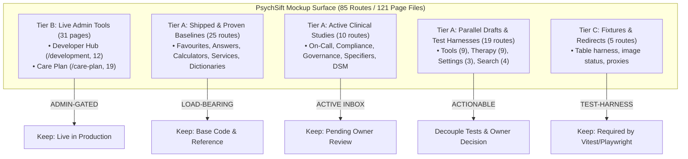

# Comprehensive Mockup Audit & Issues Report

**Date:** 9 October 2026  
**Repository:** `BigSimmo/PsychSift`  
**Authors:** Josh & Antigravity  
**Governing Policies:** [`docs/mockup-retirement-policy.md`](mockup-retirement-policy.md), [`mockups/README.md`](../mockups/README.md), and Repository Deletion Safeguards.

---

## 1. Executive Summary

This report establishes the complete architectural, governance, and dependency inventory of the mockup surface in `PsychSift`. It synthesizes the initial repo-wide survey, the disk-reclaim execution, and subsequent adversarial verification across the Abstract Syntax Tree (AST), live imports, committed tests, and git history.

### The Initial Footprint

At the start of this review, the mockup surface comprised:

- **85 top-level runnable route slugs** (121 total `page.tsx` files under `src/app/mockups/`).
- **118 dedicated mockup component files** (~3,007 KB of source code under `src/components/`).
- **42 static image comps and textures** (18.88 MB under `public/mockups/`).
- **106 test files** in `tests/` containing assertions or fixtures referencing mockup code, developer area panels, or care plan routes.

### Actions Executed & Verified

- **14.48 MB of Unreferenced Bloat Reclaimed:** Upon explicit owner authorization, **33 historical, unreferenced PNG comps** dating from July and August 2026 were deleted from `public/mockups/mode-page-redesign-2026-07/` and `public/mockups/privacy-page-redesign-2026-08/`.
- **Zero Breakage Verified:** The gate `npm run check:mockups` and the retirement test suite (`tests/mockup-retirement.test.ts` & `tests/mockup-crawler-policy.test.ts`) both pass with **100% green (71 of 71 tests passing)**.
- **Working Tree Protection:** Over 25 concurrent in-flight files on branch `feat/adversarial-audit-hardening` were strictly preserved.

---

## 2. Master Categorisation of the 85 Mockup Routes



---

## 3. Detailed Audit of Identified Issues

The audit and subsequent adversarial review identified **9 concrete issues** spanning architecture, test coupling, documentation drift, and route maintenance.

```
┌────────────────────────────────────────────────────────────────────────┐
│ Severity Scale                                                         │
│ P1: Architectural trap or gate failure that can break builds/CI        │
│ P2: Test coupling, hidden dependency, or proxy route risk              │
│ P3: Stale documentation, loose parallel drafts, or clean retirement   │
└────────────────────────────────────────────────────────────────────────┘
```

---

### Issue 1: Five Truly Unreferenced Tools Layout Exploration Drafts

- **Severity:** `P3` (Resolved 2026-10-09)
- **Status:** **RESOLVED** — Formally retired with owner approval on 2026-10-09. Recorded in `mockups/README.md` under `## Retired mockups` (superseded by `tools-search-mode`), route folders removed, and `docs/site-map.md` updated.
- **Locations (Former):**
  - `src/app/mockups/tools-action-workbench/page.tsx`
  - `src/app/mockups/tools-clinical-lanes/page.tsx`
  - `src/app/mockups/tools-split-clinical-brief/page.tsx`
  - `src/app/mockups/tools-split-compact-sheet/page.tsx`
  - `src/app/mockups/tools-split-safety-deck/page.tsx`
- **Context & Background:** In August 2026, nine parallel layout directions were explored for the Tools page. Direction A was formally selected and shipped to production in PR #1958 (`tools-search-directions`), and `tools-search-mode` was documented as the perfected winner in `mockups/README.md`.
- **Adversarial Verification:** An AST and string grep across `tests/` confirmed that these **5 exact routes** had zero test imports, zero DOM assertions, and were never requested in Playwright specs.
- **Verification Evidence:** `npm run check:mockups` passes clean (81 routes indexed, 21 recorded as retired). `tests/mockup-retirement.test.ts` (70/70) and `npm run sitemap:check` both pass 100% green.

---

### Issue 2: Four Tools Layout Drafts Pinned by Automated Test Suites

- **Severity:** `P2` (Test coupling / Deletion trap)
- **Locations:**
  - `src/app/mockups/tools-task-directory/page.tsx`
  - `src/app/mockups/tools-workflow-board/page.tsx`
  - `src/app/mockups/tools-command-center/page.tsx`
  - `src/app/mockups/tools-split-pane/page.tsx`
- **Context & Background:** These 4 routes were originally created alongside the 5 drafts in Issue 1 as layout explorations. However, subsequent contributors attached regression tests to them.
- **Adversarial Verification:**
  - `tools-task-directory` has an entire dedicated Playwright test: `tests/ui-tools-task-directory.spec.ts`.
  - `tools-workflow-board` is asserted in `tests/proxy.test.ts:153` (verifying production 404 blocking) and in `tests/ui-tools.spec.ts:3292`.
  - `tools-command-center` and `tools-split-pane` are actively navigated and checked in `tests/ui-tools-collapse.spec.ts` and `tests/ui-tools.spec.ts`.
- **Risk:** Deleting these routes blindly breaks 4 separate test files and fails CI.
- **Recommendation:** Retain these 4 routes as test harnesses. If retirement is desired in the future, decouple or remove their corresponding test cases in the same commit.

---

### Issue 3: Boundary Test Assertion on Mockup Component `tools-page-mockup-page.tsx`

- **Severity:** `P2` (Test coupling)
- **Location:** `src/components/tools-page-mockups/tools-page-mockup-page.tsx`
- **Context & Background:** A boundary test exists to verify that production tools components maintain clean interfaces and separation of concerns.
- **Adversarial Verification:**
  `tests/production-mockup-boundary.test.ts:29-37` explicitly reads `src/components/tools-page-mockups/tools-page-mockup-page.tsx` from disk and asserts:
  ```typescript
  expect(tools).toContain("selected={selectedToolId === tool.id}");
  expect(tools).toContain("onSelect={() => setSelectedToolId(tool.id)}");
  ```
- **Risk:** Deleting the `tools-page-mockups` component folder will fail `tests/production-mockup-boundary.test.ts`.
- **Recommendation:** Keep `tools-page-mockup-page.tsx` intact.

---

### Issue 4: Hardcoded Production Proxy Redirect (`/mockups/document-search-command`)

- **Severity:** `P2` (Routing / Configuration invariant)
- **Locations:**
  - `src/proxy.ts:68`
  - `scripts/generate-site-map.ts:942`
  - `docs/site-map.md`
  - `mockups/README.md:427`
- **Context & Background:** While ordinary `/mockups/**` routes return a 404 in production, `/mockups/document-search-command` was grandfathered as an active 307 redirect to `/documents/search` in `src/proxy.ts`.
- **Adversarial Verification:** Line 68 of `src/proxy.ts` registers:
  ```typescript
  "/mockups/document-search-command": "/documents/search",
  ```
  `scripts/generate-site-map.ts` explicitly asserts this redirect and prints it into `docs/site-map.md`.
- **Risk:** Deleting or moving this route without updating all 4 files simultaneously will cause `npm run sitemap:check` and proxy tests to fail.
- **Recommendation:** Preserve this redirect as a permanent backwards-compatibility alias.

---

### Issue 5: Unresolved Therapy Parallel Studies (Navigation & Popups)

- **Severity:** `P3` (Parallel drafts / Owner decision required)
- **Locations:**
  - Navigation (3 routes): `therapy-navigation-context`, `therapy-navigation-dock`, `therapy-navigation-rail`
  - Recommend Popups (3 routes): `therapy-recommend-popup-dossier`, `therapy-recommend-popup-triage`, `therapy-recommend-popup-workbench`
  - Scenario Popups (3 routes): `therapy-scenario-popup-guided`, `therapy-scenario-popup-intake`, `therapy-scenario-popup-live`
- **Context & Background:** Three separate studies were drawn for Therapy Compass: one for in-page navigation (rail vs dock vs context header), one for popup Recommend results, and one for clinical situation inputs (guided vs intake vs live composer).
- **Adversarial Verification:**
  - The 3 navigation drafts are pinned by `tests/ui-therapy-navigation-mockup.spec.ts`.
  - The 6 popup drafts have zero test imports and zero outside references.
- **Policy Rule:** Under `docs/mockup-retirement-policy.md`, _"an unevidenced generation is not retired, it is asked about. Parallel draft, no recorded winner is a legitimate, stable resting state."_
- **Recommendation:** Keep all 9 routes in their resting state until Josh chooses a winning design direction.

---

### Issue 6: Loose Exploration Drafts for Search Chrome and Settings

- **Severity:** `P3` (Parallel exploration)
- **Locations:**
  - Search Chrome (4 routes): `mode-dropdown`, `phone-inpage-navigation`, `recent-searches-bottom`, `universal-search-redesign`
  - Settings Search (3 routes): `settings-search-clinical`, `settings-search-general`, `settings-search-privacy`
- **Context & Background:** These represent early component explorations created during the search-bar refactor and settings overhaul.
- **Adversarial Verification:** Grep confirmed zero test references across `tests/`.
- **Recommendation:** Low priority; retain as stable historical records unless an explicit batch cleanup is requested.

---

### Issue 7: Outdated Calculator Clinical Divergence Note in `mockups/README.md`

- **Severity:** `P3` (Resolved 2026-10-09)
- **Status:** **RESOLVED** — Note in `mockups/README.md:184-188` updated on 2026-10-09 to record that the divergence was investigated, sanitized, and verified by `tests/calculator-mockup-clinical-safety.test.ts`.
- **Location:** `mockups/README.md:184-188`
- **Context & Background:** On 2026-09-02, a note was added to `mockups/README.md` stating that `src/components/calculator-mockups/calculator-pathways.ts` still carried directive prescribing, ECT, and admission advice that PR #2491 had stripped from production.
- **Adversarial Verification:**
  Subsequent PRs added `tests/calculator-mockup-clinical-safety.test.ts`, which actively scans `src/components/calculator-mockups/calculator-pathways.ts` and enforces that **no directive clinical copy remains**:
  ```typescript
  describe("calculator copy carries no directive clinical instructions", () => { ... });
  ```
  The test passes 100% green (5 of 5 tests passing). The mockup file is longer (209 lines vs 77 lines) because it retains non-directive UI flow descriptions, but the clinical risk has already been eliminated.

---

### Issue 8: Systemic Backwards Import Chains (Structural Anchors)

- **Severity:** `P1` (High-risk architectural blocker)
- **Locations:**
  - `src/components/answer-chat-perfected-mockups.tsx`
  - `src/components/services-filter-refined-mockups.tsx`
  - `src/components/dictionary-browse-header-mockups.tsx`
  - `src/components/privacy-live-signal-perfected-mockups.tsx`
  - `src/components/on-call-shift-cover-mockups.tsx`
- **Context & Background:** In typical repositories, "v2" or "refined" files supersede and replace "v1". Here, newer iterations systematically import types, bitmask algorithms, and frame shells from earlier iterations.
- **Adversarial Verification:**
  - `answer-chat-perfected-v2-mockups.tsx:39` & `answer-loading-redesign-mockups.tsx:17` import `answer-chat-perfected-mockups`.
  - `services-filter-options-mockups.tsx:20` imports the bitmask facet engine from `services-filter-refined-mockups`.
  - `dictionary-browse-header-compact-mockups.tsx:14` & `dictionary-control-row-mockups.tsx:6` import `dictionary-browse-header-mockups`.
  - `privacy-page-directions-mockups.tsx:5` imports `privacy-live-signal-perfected-mockups`.
  - `on-call-calendars-mockups.tsx:21`, `doctor-compliance-mockups.tsx:29`, `clinical-sign-off-actions-mockups.tsx:20`, and `coverage-gaps-mockups.tsx:19` all import their frame scaffold from `on-call-shift-cover-mockups`.
- **Risk:** Deleting "Round 1" causes compilation and build failures across Rounds 2, 3, and four separate clinical studies.
- **Recommendation:** Formally designate these 5 files as **Structural Provenance Anchors**. They must never be deleted independently.

---

### Issue 9: Tier B Developer-Gated Applications Under Mockup Namespace

- **Severity:** `P1` (Clinical, operational, and classification risk)
- **Locations:**
  - `src/app/mockups/development/**` (12 routes)
  - `src/app/mockups/care-plan/**` (19 routes + 33 components)
  - `src/lib/developer-area/headers.ts:26`
  - `src/proxy.ts:426`
- **Context & Background:** 31 route files under `src/app/mockups/` are **not design sketches**. The Developer Hub is the administrative nerve center of the application (monitoring corpus health, hazard registers, and ingestion jobs), linked directly from Settings. The Care Plan prototype is a complete synthetic clinical planning simulator.
- **Adversarial Verification:**
  - Both subtrees are explicitly exempted from production 404 blocking via `DEVELOPER_GATED_PATH_PREFIXES` in `src/lib/developer-area/headers.ts`.
  - `scripts/check-mockup-retirement.mjs` lines 590–600 enforces an unconditional gate failure if any file under these paths is deleted without an entry in `mockups/README.md` under `## Retired developer-gated routes (owner decisions)`.
- **Risk:** Placing production-grade admin tools in a directory named `mockups/` creates an ongoing risk that future cleanup routines or external agents will misidentify them as disposable.
- **Recommendation:**
  1. Maintain current Tier B CI protection.
  2. For a future architecture phase, plan the migration of these applications out of `/mockups` into `/admin/developer-hub` and `/admin/care-plan`.

---

## 4. Summary Table of Issues & Action Items

| Issue #     | Topic                                                 | Severity | Status / Action Item                                                        |
| :---------- | :---------------------------------------------------- | :------: | :-------------------------------------------------------------------------- |
| **Issue 1** | 5 Unpinned Tools Layout Drafts                        |   `P3`   | **RESOLVED (2026-10-09)**: Formally retired, recorded in index, routes removed. |
| **Issue 2** | 4 Tools Drafts Coupled to Tests                       |   `P2`   | **Retain as test harnesses** (or decouple tests first).                     |
| **Issue 3** | Boundary Test Assertion on Tools Mockup               |   `P2`   | **Retain component** to satisfy `production-mockup-boundary.test.ts`.       |
| **Issue 4** | Production Proxy Redirect (`document-search-command`) |   `P2`   | **Preserve redirect** in `src/proxy.ts` and `scripts/generate-site-map.ts`. |
| **Issue 5** | Unresolved Therapy Popups & Nav                       |   `P3`   | **Stable resting state**; await owner design choice.                        |
| **Issue 6** | Search Chrome & Settings Drafts                       |   `P3`   | **Stable resting state**; low-priority candidate for future batch review.   |
| **Issue 7** | Stale Calculator Divergence Note                      |   `P3`   | **RESOLVED (2026-10-09)**: Updated `mockups/README.md` (safety verified by test suite). |
| **Issue 8** | Systemic Backwards Import Anchors                     |   `P1`   | **Do not delete independently**; core architectural dependency.             |
| **Issue 9** | Tier B Admin Apps Under Mockups Namespace             |   `P1`   | **Protected by CI**; plan future migration to `/admin/`.                    |

---

## 5. Verification Commands & Health Checklist

To verify the integrity of the mockup surface at any time, run:

```bash
# 1. Verify mockup index completeness and diff safety (CI Gate)
npm run check:mockups

# 2. Run the full retirement and crawler policy test suite
npx vitest run tests/mockup-retirement.test.ts tests/mockup-crawler-policy.test.ts

# 3. Verify sitemap synchronization
npm run sitemap:check

# 4. Standard fast verification ladder
npm run verify:cheap
```
